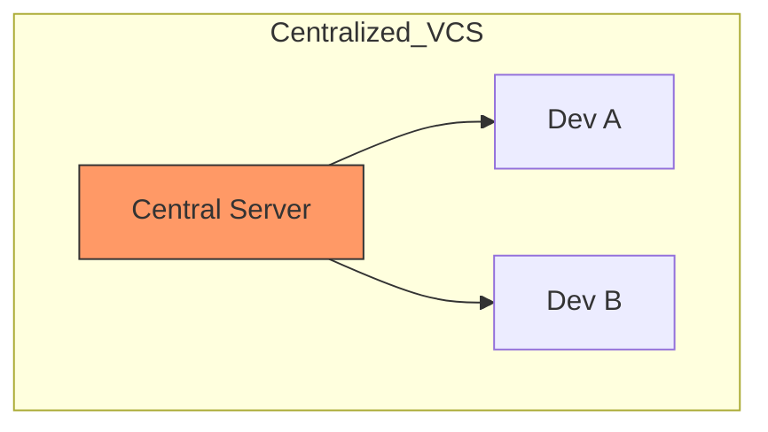

# CH-01: Pre-Git-Crisis (The Landscape Before the Engine)

> **"Sebelum ada Git, dunia kolaborasi perangkat lunak berada dalam kegelapan fragmentasi."**

## 🔗 1. Source Link
- [A Short History of Git (Official)](https://git-scm.com/book/en/v2/Getting-Started-A-Short-History-of-Git)
- [Linus Torvalds on BitKeeper (Google Tech Talk)](https://www.youtube.com/watch?v=4XpnKHJAok8)

## 📖 2. Penjelasan (The What & The Why)
Sebelum tahun 2005, pengembangan Kernel Linux menggunakan sistem VCS bernama **BitKeeper**. Namun, karena perubahan lisensi yang kontroversial, komunitas Linux kehilangan akses ke alat tersebut. Linus Torvalds memutuskan untuk membuat alat sendiri dalam waktu 2 minggu. Krisis ini adalah alasan mengapa Git memiliki DNA yang sangat berbeda dari VCS tradisional (seperti CVS atau SVN) yang lambat dan terpusat.

## 🏗️ 3. Architecture Concept: The Tower of Babel
Bayangkan ratusan pengembang mencoba membangun menara raksasa, tetapi setiap kali seseorang ingin menambah bata, mereka harus mengantre di satu pintu pusat yang sangat lambat. Jika pintu itu terkunci, pembangunan berhenti total. Git menghancurkan konsep pintu pusat ini dan memberikan setiap pengembang "salinan utuh lorong waktu" mereka sendiri.

## 📊 4. Visual Graph (Mermaid)
Mekanika Kolaborasi Terpusat (VCS Tradisional) vs Terdistribusi (Git):



## 🛠️ 5. Under-the-hood Mechanics
VCS lama menyimpan **Delta** (hanya perubahan baris). Jika satu file di tengah sejarah korup, seluruh sejarah ke depan bisa hancur. Git menyimpan **Snapshots** dan memvalidasinya dengan **SHA-1 ID**. Ini memberikan integritas data mutlak yang tidak dimiliki alat sebelumnya.

## 🧪 6. Practical CLI Lab
Mari mensimulasikan bagaimana kita melihat "jejak sejarah" sederhana:

```bash
# Membuat repositori simulasi krisis
mkdir crisis-lab && cd crisis-lab
git init

# Menambahkan catatan sejarah awal
echo "Visi Awal: Kecepatan" > filosofi.txt
git add filosofi.txt
git commit -m "feat: inisialisasi visi kecepatan"

# Melihat sejarah minimalis
git log --oneline
```

## 🤝 7. Team Impact (Social Governance)
Tanpa Git, tim sering mengalami *stagnasi kolaborasi* karena "merge" adalah hal yang menakutkan dan sulit dilakukan. Git membuat "branching" menjadi murah dan cepat, memungkinkan tim bereksperimen tanpa rasa takut.

## 🚑 8. The Rescue (Undo Tactics)
Jika Anda salah meng-inisialisasi repositori atau ingin menghapus seluruh jejak `.git` untuk mulai dari nol:
```bash
# Menghapus seluruh folder internals Git (Gunakan dengan sangat hati-hati!)
# rm -rf .git
```
*Catatan: Selalu lakukan backup sebelum melakukan operasi destruktif pada folder `.git`.*
