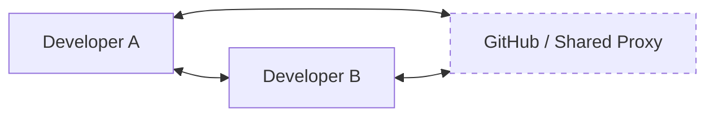

# CH-02: Visi Linus Torvalds (The Blueprint of Speed & Trust)

> **"Git dirancang dengan kebencian mendalam terhadap CVS dan keinginan untuk performa mutlak."**

## 🔗 1. Source Link
- [A Short History of Git (Official)](https://git-scm.com/book/en/v2/Getting-Started-A-Short-History-of-Git)
- [Linus Torvalds: The Mind Behind Linux & Git (TED Blog)](https://blog.ted.com/the-mind-behind-linux-ted-talks-blog/)

## 📖 2. Penjelasan (The What & The Why)
Linus Torvalds memiliki visi sederhana namun radikal untuk Git:
1. **Kecepatan**: Operasi harus instan.
2. **Desain Sederhana**: Logikanya harus elegan dan kuat.
3. **Desentralisasi Penuh**: Tidak perlu izin server pusat untuk bekerja.
4. **Alur Kerja Paralel**: Memungkinkan ribuan cabang fitur hidup berdampingan.
5. **Integritas Data**: Tidak mentoleransi korupsi file sekecil apa pun.

## 🏗️ 3. Architecture Concept: The Photographer
Jika VCS tradisional adalah **Juru Tulis** yang mencatat setiap coretan (Delta), maka Git adalah seorang **Fotografer** yang mengambil foto utuh (Snapshot) dari seluruh berkas setiap kali Anda melakukan commit. Saat Anda butuh versi lama, sang fotografer cukup menunjukkan album fotonya.

## 📊 4. Visual Graph (Mermaid)
Visi Desentralisasi Torvalds:



## 🛠️ 5. Under-the-hood Mechanics: SHA-1 Integrity
Satu-satunya cara untuk menjamin **Trust** (Kepercayaan) dalam sistem terdesentralisasi adalah melalui kriptografi. Setiap objek di Git diidentifikasi melalui hash SHA-1 unik. Jika ada satu bit saja yang berubah, hash akan berubah, dan Git akan segera mengetahuinya.

## 🧪 6. Practical CLI Lab
Mari melihat bagaimana Git melacak "status" kerja kita tanpa bertanya ke server:

```bash
# Mengecek status tanpa koneksi internet
git status

# Melihat log dengan statistik perubahan
git log --stat
```

## 🤝 7. Team Impact (Social Governance)
Visi Linus membawa dampak pada **Trust-less Collaboration**. Anda dapat bekerja di gua tanpa internet selama seminggu, dan saat kembali, seluruh sejarah kerja Anda dapat disinkronkan tanpa kehilangan konteks.

## 🚑 8. The Rescue (Undo Tactics)
Jika Anda sudah terlanjur melakukan commit tetapi ingin mengubah pesan commit terakhir (karena typo atau kurang jelas):
```bash
git commit --amend -m "feat: revisi pesan commit sesuai visi"
```
*Gunakan ini untuk menjaga kualitas sejarah tetap tinggi.*
