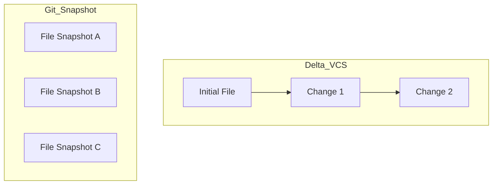

# CH-01: Snapshots vs Deltas (The Physics of Versioning)

> **"Git tidak menyimpan perbedaan; Git melestarikan realitas."**

## 🔗 1. Source Link
- [Git Internals - Git Objects (Official)](https://git-scm.com/book/en/v2/Git-Internals-Git-Objects)

## 📖 2. Penjelasan (The What & The Why)
VCS tradisional (SVN, CVS, Perforce) melihat data sebagai sekumpulan file dengan daftar perubahan yang bertambah seiring waktu (**Delta-based**). Sebaliknya, Git melihat data sebagai sekelompok foto dari miniatur sistem file (**Snapshots**). Ini adalah alasan utama mengapa Git sangat cepat dalam berpindah cabang (*checkout*) dan melakukan *merging*.

## 🏗️ 3. Architecture Concept: Moving Pictures
Bayangkan sebuah film. VCS lama menyimpan "bingkai pertama" dan mencatat "pergerakan piksel" di bingkai berikutnya. Jika bingkai tengah hilang, film rusak. Git menyimpan setiap **Buku Komik** di mana setiap halaman adalah gambaran lengkap dari seluruh dunia pada detik itu. Anda bisa langsung membuka halaman mana pun tanpa harus membaca dari awal.

## 📊 4. Visual Graph (Mermaid)
Perbedaan Penyimpanan Antara Delta vs Snapshot:



## 🛠️ 5. Under-the-hood Mechanics
Secara internal, Git tidak menyimpan file yang sama dua kali. Jika sebuah file tidak berubah di commit selanjutnya, Git tidak menyalin file tersebut, melainkan hanya menyimpan **Link** (penunjuk) ke file yang sudah ada sebelumnya. Ini disebut sebagai **Content-Addressable Storage**.

## 🧪 6. Practical CLI Lab: Verifying the Blob Identity
Mari bereksperimen dengan identitas konten:

```bash
# Membuat dua file dengan isi yang sama persis
echo "Snapshots rule!" > file1.txt
echo "Snapshots rule!" > file2.txt

# Menambahkan ke staging
git add file1.txt file2.txt

# Melihat objek yang terbentuk (Keduanya akan memiliki SHA-1 yang sama)
# Git hanya menyimpan SATU objek fisik untuk dua file yang isinya sama
git ls-files --stage
```

## 🤝 7. Team Impact (Social Governance)
Paradigma Snapshot memungkinkan tim untuk melakukan **Branching Pararel** dengan biaya hampir nol. Karena Git hanya perlu memutar penunjuk (pointer) ke snapshot tertentu, beralih antar fitur menjadi instan dan tidak mengganggu alur kerja orang lain.

## 🚑 8. The Rescue (Undo Tactics): Restoring a Snapshot
Jika file Anda rusak saat sedang diedit dan Anda ingin mengembalikannya ke kondisi snapshot terakhir:
```bash
# Mengembalikan file speisifik ke snapshot terakhir
git checkout -- <file_name>
```
*Hati-hati: Perubahan yang belum di-commit akan hilang permanen.*
