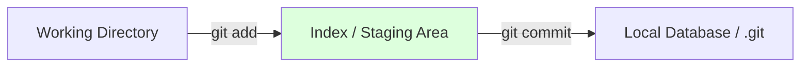

# CH-01: Defining Git (The Engine)

> **"Git adalah mesin jet di bawah kap; GitHub adalah landasan pacunya."**

## 🔗 1. Source Link
- [What is Git? (Official Intro)](https://git-scm.com/video/what-is-git)

## 📖 2. Penjelasan (The What & The Why)
Git adalah **sistem kontrol versi terdistribusi** (DVCS) yang berjalan sepenuhnya di komputer lokal Anda. Ia adalah mesin yang melacak setiap perubahan, mengelola cabang paralel, dan memastikan integritas data melalui hash SHA-1. Anda tidak butuh internet untuk menggunakan Git; seluruh "mesin waktu" ada di dalam folder `.git` lokal Anda.

## 🏗️ 3. Architecture Concept: The Clockwork
Bayangkan Git sebagai mekanisme jam internal yang sangat presisi di pergelangan tangan Anda. Ia mencatat setiap detak detik (commit) secara mandiri. Ia adalah alat pertukangan (tooling) murni untuk memahat sejarah kode Anda sendiri.

## 📊 4. Visual Graph (Mermaid)
Siklus Kerja Lokal Git (**The Local Three-Stage Architecture**):



## 🛠️ 5. Under-the-hood Mechanics: The .git/index
Inti dari Git lokal adalah berkas **Index** (disebut juga *Staging Area*). Ini adalah gerbang di mana Git mempersiapkan snapshot berikutnya sebelum benar-benar menulisnya ke dalam database objek permanen.

## 🧪 6. Practical CLI Lab
Mari melihat identitas lokal Git Anda:

```bash
# Mengecek versi mesin Git
git version

# Melihat lokasi folder internal pangkalan data
git rev-parse --git-dir
```

## 🤝 7. Team Impact (Social Governance)
Git lokal memberikan pengembang **kebebasan penuh**. Anda bisa melakukan puluhan commit eksperimental secara lokal, merapikannya, lalu baru mengirimkannya ke tim. Ini meminimalkan "kebisingan" pada sejarah publik.

## 🚑 8. The Rescue (Undo Tactics): Back to Stable
Jika Anda melakukan eksperimen lokal yang gagal dan ingin kembali ke kondisi commit terakhir:
```bash
# Menghapus seluruh perubahan yang belum dikomit (DENGAN PERINGATAN!)
git reset --hard HEAD
```
