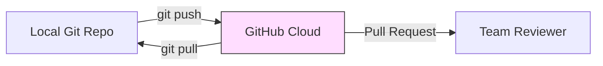

# CH-02: Defining GitHub (The Ecosystem)

> **"GitHub adalah pelabuhan pusat di mana ribuan kapal (Git) bertemu untuk bertukar kargo."**

## 🔗 1. Source Link
- [GitHub Platform Overview](https://docs.github.com/en/get-started/onboarding/getting-started-with-github)

## 📖 2. Penjelasan (The What & The Why)
GitHub adalah platform **hosting** berbasis cloud yang menyediakan antarmuka sosial dan alat kolaborasi di atas mesin Git. Jika Git adalah alat pertukangan, GitHub adalah **Gudang & Showroom** publiknya. Di sini kita menemukan fitur-fitur yang tidak dimiliki Git murni, seperti Pull Requests, Issue Tracking, dan GitHub Actions.

## 🏗️ 3. Architecture Concept: The Social Network for Code
Bayangkan GitHub sebagai **LinkedIn untuk Kode**. Git hanya merekam apa yang Anda lakukan, tetapi GitHub memberi tahu dunia apa yang Anda kerjakan, memungkinkan orang lain memberikan masukan (Code Review), dan mengizinkan robot otomatis (CI/CD) memeriksa kualitas kerja Anda.

## 📊 4. Visual Graph (Mermaid)
Aliran sinkronisasi antara Lokal (Git) dan Remote (GitHub):



## 🛠️ 5. Under-the-hood Mechanics: The Transport Layer
GitHub berkomunikasi dengan Git lokal melalui protokol **SSH** atau **HTTPS**. Ia bertindak sebagai "Bare Repository" (repository tanpa working directory) yang siap menerima kiriman paket objek dari mesin-mesin lokal pengembang.

## 🧪 6. Practical CLI Lab
Mari melihat ke mana Git lokal Anda "melirik" (tujuan remote):

```bash
# Melihat daftar terminal remote (pelabuhan) yang terhubung
git remote -v

# Melihat detail statistik di sisi GitHub (jika terkoneksi gh-cli)
# gh repo view
```

## 🤝 7. Team Impact (Social Governance)
GitHub menerapkan **Governance Policy** (kebijakan tata kelola). Di level ini, kita menggunakan *Branch Protection Rules* agar tidak sembarang orang bisa menghapus sejarah utama (Main Branch) dan mewajibkan adanya ulasan sebelum kode digabungkan.

## 🚑 8. The Rescue (Undo Tactics): Remote Cleanup
Jika Anda salah menambahkan alamat remote:
```bash
# Menghapus koneksi ke remote yang salah
git remote remove origin
```
*Ini tidak menghapus kode lokal, hanya memutuskan hubungannya dengan server tersebut.*
