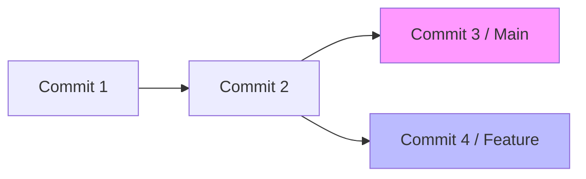

# CH-01: DAG, Objects & Hashes (The Senior Alphabet)

> **"Jika Anda tidak mengerti DAG, Anda hanya menebak-nebak apa yang Git lakukan."**

## 🔗 1. Source Link
- [Git Internals - Git Objects (Official)](https://git-scm.com/book/en/v2/Git-Internals-Git-Objects)

## 📖 2. Penjelasan (The What & The Why)
Di level Senior, kita tidak lagi berbicara tentang "file" dan "folder" di dalam Git, melainkan tentang **Objek**. Git adalah *Content-Addressable Storage*, artinya ia menyimpan konten dan memberinya label berupa **Hash SHA-1**. Kumpulan objek-objek ini saling terhubung membentuk sebuah graf yang disebut **DAG (Directed Acyclic Graph)**—sebuah graf yang mengalir satu arah dan tidak pernah melingkar.

## 🏗️ 3. Architecture Concept: The Parallel Universe
Setiap **Hash** (ID unik 40 karakter) adalah koordinat presisi di dalam jagat raya Git. DAG adalah peta jalur waktu dari jagat raya tersebut. Saat Anda membuat cabang baru, Anda sebenarnya hanya menempelkan label baru pada salah satu titik di graf tersebut, bukan menyalin seluruh jagat raya.

## 📊 4. Visual Graph (Mermaid)
Representasi **Directed Acyclic Graph (DAG)**:



## 🛠️ 5. Under-the-hood Mechanics: SHA-1 Calculation
Hash Git dihitung berdasarkan:
`sha1("blob " + size + "\0" + content)`
Ini memastikan bahwa konten yang sama akan selalu menghasilkan Hash yang sama, di mana pun dan kapan pun. Git menggunakan ini untuk deduplikasi data (tidak menyimpan konten yang sama dua kali).

## 🧪 6. Practical CLI Lab
Mari membedah sebuah objek secara mentah (*raw*):

```bash
# Membuat objek blob sederhana
echo "Senior Git Mastery" | git hash-object -w --stdin

# Melihat tipe asli objek tersebut
git cat-file -t <hash_tadi>

# Melihat isi asli objek tersebut
git cat-file -p <hash_tadi>
```

## 🤝 7. Team Impact (Social Governance)
Memahami DAG membantu tim dalam melakukan **Debugging Sejarah**. Jika ada commit yang "hilang", seorang Senior bisa menelusuri DAG menggunakan `reflog` untuk menemukan titik koordinat (Hash) yang terputus tersebut.

## 🚑 8. The Rescue (Undo Tactics): Finding the Lost Object
Jika Anda tidak sengaja menghapus cabang, objek fisiknya masih ada di dalam DAG selama beberapa waktu. Anda bisa menemukannya dengan:
```bash
# Mencari objek yang tidak terjangkau (dangling) di dalam graf
git fsck --full
```
*Gunakan hash yang ditemukan untuk mengembalikan cabang yang hilang.*
