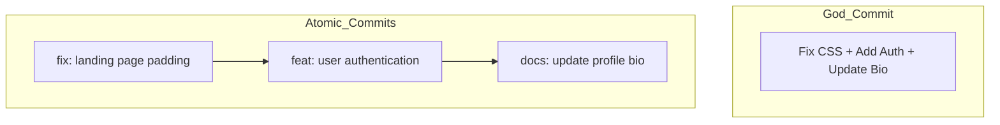

# CH-01: Single Responsibility Commits (The Atomic Standard)

> **"Satu commit, satu tujuan. Kemurnian sejarah adalah kunci kemudahan debugging."**

## 🔗 1. Source Link
- [Git Best Practices - Atomic Commits](https://www.freshconsulting.com/insights/blog/atomic-commits/)

## 📖 2. Penjelasan (The What & The Why)
**Atomic Commits** adalah praktik di mana setiap commit hanya berisi satu perubahan fungsional terkecil yang lengkap. Jika Anda memperbaiki bug sekaligus menambahkan fitur baru, itu **bukan** atomic commit. Commit yang terpecah secara logis memudahkan tim melakukan *code review*, memungkinkan *revert* yang aman, dan menjaga agar sejarah Git tetap bercerita tentang evolusi fitur.

## 🏗️ 3. Architecture Concept: The LEGO Blocks
Bayangkan sejarah Git sebagai rangkaian **Balok LEGO**. Jika satu balok berisi fondasi, jendela, dan atap sekaligus, Anda tidak bisa mengganti jendela tanpa membongkar seluruh rumah. Dengan Atomic Commits, setiap balok adalah komponen independen yang bisa dicopot atau diganti tanpa merusak struktur lainnya.

## 📊 4. Visual Graph (Mermaid)
Perbedaan antara God Commit vs Atomic Commits:



## 🛠️ 5. Under-the-hood Mechanics
Secara internal, Atomic Commits menghasilkan **Delta** yang kecil dan spesifik. Ini mengoptimalkan performa perintah seperti `git bisect` (untuk mencari bug secara binary search) karena rentang kode yang harus diperiksa per commit sangatlah sempit.

## 🧪 6. Practical CLI Lab
Cara memisahkan perubahan besar menjadi atomic commits menggunakan *patching*:

```bash
# Mengedit file dengan banyak perubahan
echo "perubahan 1" >> app.js
echo "perubahan 2" >> app.js

# Menambahkan hanya sebagian perubahan (Hunk) secara interaktif
git add -p app.js

# Pilih 'y' untuk bagian yang ingin dimasukkan ke commit pertama, 'n' untuk sisanya.
```

## 🤝 7. Team Impact (Social Governance)
Atomic Commits meningkatkan **Code Review Velocity**. Reviewer tidak perlu pusing melihat 500 baris perubahan yang tidak berhubungan. Mereka bisa menyetujui perubahan kecil satu per satu dengan lebih cepat dan akurat.

## 🚑 8. The Rescue (Undo Tactics): Selective Revert
Jika salah satu dari commit atomic Anda ternyata bermasalah, Anda bisa membatalkannya secara spesifik tanpa mengganggu fitur lain yang masuk di hari yang sama:
```bash
# Membatalkan hanya satu commit spesifik tanpa merusak sejarah depannya
git revert <commit_hash>
```
