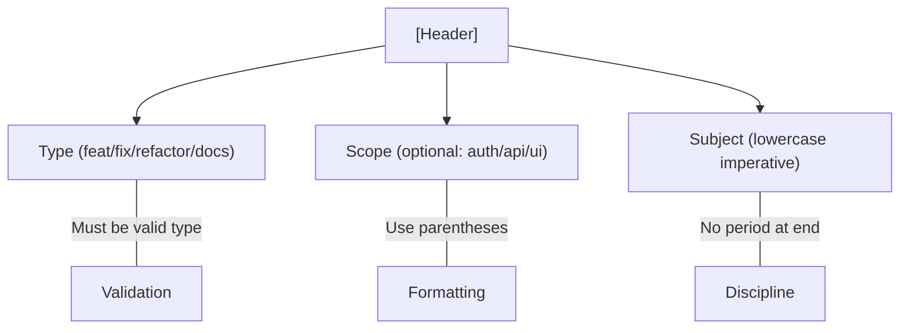

# 🏷️ CH-01: Header Rules (Types & Scopes)

> **"Header adalah intisari dari sebuah perubahan besar."**

## 🔗 1. Source Link
- [Conventional Commits: Specification](https://www.conventionalcommits.org/en/v1.0.0/#specification)
- [Angular Commit Message Guidelines](https://github.com/angular/angular/blob/main/CONTRIBUTING.md#-commit-message-format)

## 📖 2. Penjelasan (The What & The Why)
Header adalah baris pertama dari pesan commit. Standar senior mewajibkan format: `<type>(scope): <subject>`.
- **Type**: Menentukan klasifikasi perubahan (fisik atau logis).
- **Scope**: Menentukan area kode yang terdampak (opsional tapi disarankan).
- **Subject**: Deskripsi singkat aksi yang dilakukan.

## 🏗️ 3. Architecture Concept: The Labeling System
Bayangkan sebuah **Gudang Raksasa**. Tanpa label yang jelas, petugas akan bingung.
- `feat`: Barang baru masuk rak.
- `fix`: Memperbaiki barang yang rusak di rak.
- `docs`: Menambah label instruksi pada rak.
- `chore`: Membersihkan debu di gudang (maintenance).

## 📊 4. Visual Graph (Header Anatomy)


## 🧪 5. CLI Labs (Standard Types)
Gunakan `feat` untuk fitur baru dan `fix` untuk perbaikan bug.
```bash
# Feature: Menambah sistem login
git commit -m "feat(auth): implement jwt token generation"

# Fix: Memperbaiki crash pada saat logout
git commit -m "fix(session): prevent null pointer on log out"

# Refactor: Membersihkan kode tanpa merubah fungsi
git commit -m "refactor(api): simplify database query logic"
```

## 🛠️ 6. Under-the-hood Mechanics
Tools seperti `commitlint` membaca header ini untuk memutuskan apakah pipeline CI/CD boleh berlanjut atau harus berhenti. Header yang salah format akan ditolak sistem secara otomatis.

## 🤝 7. Team Impact
Saat Anda melakukan `git log --oneline`, header yang rapi memungkinkan rekan tim memindai perubahan dalam hitungan detik.
- `feat(ui): add dark mode`
- `fix(core): memory leak in worker`
- `docs: update deployment guide`

## 🚑 8. Senior Tip: Breaking Changes
Jika perubahan merusak kompatibilitas (Breaking Change), tambahkan tanda seru `!` sebelum titik dua.
```bash
git commit -m "feat(api)!: remove deprecated v1 endpoints"
# Pesan ini akan otomatis memicu kenaikan MAJOR version pada SemVer.
```
