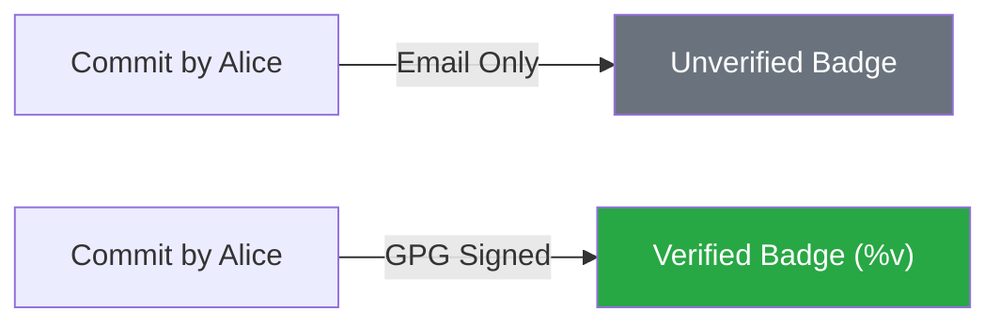

# 🛡️ CH-01: Atomic Concepts & GPG Identity

> **"Satu commit, satu tujuan. Dan setiap tujuan harus terverifikasi identitasnya."**

## 🔗 1. Source Link
- [Git Best Practices - Atomic Commits](https://www.freshconsulting.com/insights/blog/atomic-commits/)
- [GitHub: About GPG Commit Verification](https://docs.github.com/en/authentication/managing-commit-signature-verification/about-commit-signature-verification)

## 📖 2. Penjelasan (The What & The Why)
- **Atomic Commits**: Praktik di mana setiap commit hanya berisi satu perubahan fungsional terkecil yang lengkap. Ini memudahkan *revert* dan *code review*.
- **GPG Identity**: Menggunakan kunci kriptografi untuk menandatangani commit Anda. Ini memberikan lencana **Verified** di GitHub, memastikan bahwa commit tersebut benar-benar berasal dari Anda dan bukan orang lain yang memalsukan email Anda.

## 🏗️ 3. Architecture Concept: Validated Blocks
Bayangkan sejarah Git sebagai **Rantai Blok (Blockchain)**.
1.  **Atomic**: Ukuran blok yang pas (tidak terlalu besar/kecil).
2.  **GPG Signature**: Stempel segel resmi pada setiap blok yang membuktikan keaslian pembuatnya.

## 📊 4. Visual Comparison (Verified vs Unverified)


## 🧪 5. CLI Labs (Atomic & GPG)
### Step A: Atomic Patching
Jika Anda terlanjur merubah banyak hal, gunakan `add -p` (patch) untuk memisahkan commit.
```bash
git add -p [filename]
# Pilih 'y' untuk memasukkan bagian kode tersebut, 'n' untuk melewati.
```

### Step B: GPG Signing
Setelah mengonfigurasi kunci GPG di Git:
```bash
# Melakukan commit dengan tanda tangan (-S)
git commit -S -m "feat(auth): add secure gpg signing"

# Melihat riwayat dengan status verifikasi
git log --show-signature
```

## 🛠️ 6. Under-the-hood Mechanics
Secara internal, Git menyimpan tanda tangan GPG di dalam objek commit itu sendiri. Saat di-push ke GitHub, GitHub mencocokkan kunci publik yang Anda unggah dengan tanda tangan di commit untuk memberikan tanda centang hijau.

## 🤝 7. Team Impact
Menerapkan Atomic Commits meningkatkan **Velocity Code Review**, sementara GPG Signing meningkatkan **Trust & Security** di dalam tim, terutama pada proyek open-source atau korporat besar.

## 🚑 8. Senior Tip: Default Signing
Seorang Senior tidak ingin mengetik `-S` setiap saat. Atur Git agar selalu menandatangani commit secara otomatis:
```bash
git config --global commit.gpgsign true
```
