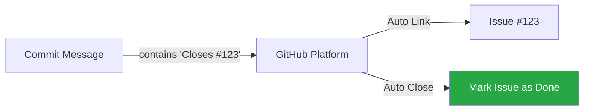

# 🔗 CH-02: Integration Power (Closes #123)

> **"Commit Anda bukan pulau terisolasi. Hubungkan dengan gambaran besar."**

## 🔗 1. Source Link
- [GitHub: Linking a pull request to an issue](https://docs.github.com/en/issues/tracking-your-work-with-issues/linking-a-pull-request-to-an-issue)
- [Closing issues using keywords](https://docs.github.com/en/issues/tracking-your-work-with-issues/linking-a-pull-request-to-an-issue#linking-a-pull-request-to-an-issue-using-a-keyword)

## 📖 2. Penjelasan (The What & The Why)
**Integration Power** adalah kemampuan menghubungkan setiap baris kode dengan alasan perubahan tersebut ada (Issue/Task). Menggunakan kata kunci tertentu dalam pesan commit akan memberi tahu GitHub untuk secara otomatis memperbarui, menautkan, atau bahkan menutup issue yang terkait.
- **Keywords**: `fixes`, `closes`, `resolves`.
- **Target**: Issue ID atau Pull Request ID.

## 🏗️ 3. Architecture Concept: The Bridge
Bayangkan sebuah jembatan yang menghubungkan **Dunia Masalah** (Issues) dengan **Dunia Kode** (Commits).
- **Issue**: "Login button is broken." (#123)
- **Commit**: "fix(ui): mend login button padding. Closes #123"
Jembatan ini memungkinkan siapa pun di masa depan untuk mengklik link di commit dan melihat konteks lengkap mengapa perubahan ini dilakukan.

## 📊 4. Visual Workflow (Automated Tracking)


## 🧪 5. CLI Labs (Integration Keywords)
Gunakan kata kunci penutup di bagian **Footer** pesan commit Anda.
```bash
# Contoh commit yang menghubungkan issue
git commit -m "feat(api): add jwt token support" \
           -m "The api now supports JWT for authentication. Fixes #234"

# Jika ada beberapa issue sekaligus
git commit -m "refactor(sql): optimize query speed" \
           -m "Closes #111, Closes #112"
```

## 🛠️ 6. Under-the-hood Mechanics
GitHub Engine memindai setiap commit yang masuk ke default branch. Jika ia menemukan ekspresi reguler yang cocok dengan keyword tertentu diikuti oleh `#ID`, ia akan memicu webhook internal untuk memperbarui database issue terkait.

## 🤝 7. Team Impact
Meningkatkan transparansi tim. Manajer proyek atau QA bisa langsung tahu apakah suatu bug sudah diperbaiki hanya dengan melihat status issue tanpa harus bertanya ke developer atau memeriksa log satu per satu.

## 🚑 8. Senior Tip: Traceability Matrix
Jangan pernah membuat commit "mengambang". Selalu hubungkan dengan Task ID dari JIRA, Trello, atau GitHub Issues. Ini menciptakan **Traceability Matrix** yang sangat kuat untuk audit keamanan dan debugging di masa depan.
