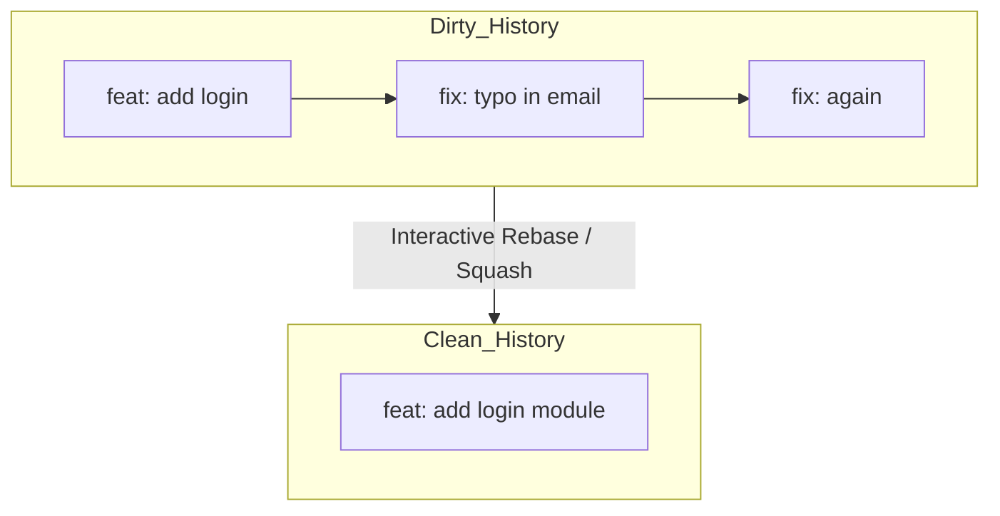

# 🧹 CH-03: Rescue & Clean (Amend & Squash)

> **"Kesalahan itu wajar. Meninggalkan sejarah yang kotor adalah pilihan."**

## 🔗 1. Source Link
- [Git: git-commit --amend](https://git-scm.com/book/en/v2/Git-Basics-Undoing-Things#_changing_your_last_commit)
- [Git: git-rebase --interactive (Squashing)](https://git-scm.com/book/en/v2/Git-Tools-Rewriting-History#_squashing_commits)

## 📖 2. Penjelasan (The What & The Why)
**Rescue & Clean** adalah teknik pembersihan sejarah sebelum perubahan tersebut di-push ke repository publik (Remote). Seorang senior tidak akan membiarkan commit seperti "typo", "fix lagi", "test" masuk ke sejarah utama. Mereka akan menggunakan:
- **Amend**: Memperbaiki pesan atau isi pada commit terakhir.
- **Squash**: Menggabungkan beberapa commit kecil menjadi satu commit fungsional yang bermakna.

## 🏗️ 3. Architecture Concept: The Sculptor
Seorang pemahat tidak langsung membuat patung yang sempurna.
1.  **Work**: Menatah batu sedikit demi sedikit (Small Commits).
2.  **Polish**: Menghaluskan permukaan sebelum dipamerkan (Squashing).
3.  **Result**: Hanya menampilkan hasil akhir yang sempurna ke khalayak.

## 📊 4. Visual Workflow (Squashing Commits)


## 🧪 5. CLI Labs (Cleaning Before Push)
### Step A: The Quick Amend
Gunakan ini jika pesan commit terakhir salah atau ada file yang lupa di-add.
```bash
git add [forgotten_file]
git commit --amend --no-edit # Menambah file ke commit terakhir tanpa merubah pesan.
```

### Step B: The Interactive Squash
Gunakan untuk menggabungkan 3 commit terakhir.
```bash
git rebase -i HEAD~3
# Ganti kata 'pick' menjadi 's' atau 'squash' pada baris ke-2 dan ke-3.
# Simpan editor, lalu gabungkan pesannya.
```

## 🛠️ 6. Under-the-hood Mechanics
Secara internal, `amend` dan `squash` akan **membuat objek commit baru** dengan hash yang berbeda dari aslinya. Karena sejarahnya berubah, Anda harus menggunakan `--force-with-lease` jika ingin mengupdate commit yang sudah terlanjur di-push ke server.

## 🤝 7. Team Impact
Sejarah repository menjadi sangat bersih dan mudah ditinjau (Audit-ready). Rekan tim lain tidak akan terganggu oleh rentetan commit eksperimental yang tidak berarti.

## 🚑 8. Senior Tip: Local Only!
**PENTING**: Hanya lakukan pembersihan sejarah (Rewriting History) pada commit yang masih berada di komputer lokal Anda. Jangan pernah melakukan `squash` atau `amend` pada commit yang sudah ditarik (`pull`) oleh rekan tim lain, karena akan merusak sejarah milik mereka.
