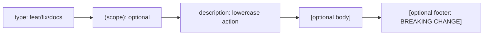

# CH-01: Commit Linting & Conventional Standards

> **"Bicaralah dalam bahasa yang dipahami manusia dan mesin secara bersamaan."**

## 🔗 1. Source Link
- [Conventional Commits Specification](https://www.conventionalcommits.org/en/v1.0.0/)

## 📖 2. Penjelasan (The What & The Why)
**Conventional Commits** adalah serangkaian aturan ringan untuk pesan commit yang membantu tim dalam membuat sejarah kode yang terstruktur. Format dasarnya adalah: `<type>(scope): <description>`. Penggunaan standar ini bukan hanya soal kerapian, tapi juga memungkinkan otomasi canggih seperti pembuatan *Changelog* otomatis dan penentuan versi semantik (*SemVer*).

## 🏗️ 3. Architecture Concept: The Labeling System
Bayangkan sebuah **Gudang Raksasa**. Jika setiap kotak diberi label sembarang (seperti "udah bener", "tambahan dikit"), petugas gudang akan kesulitan mencari barang. Dengan Conventional Commits, setiap kotak memiliki label departemen yang jelas: `feat` (barang baru), `fix` (perbaikan barang rusak), atau `chore` (pembersihan gudang).

## 📊 4. Visual Graph (Mermaid)
Struktur Pesan Konvensional:



## 🛠️ 5. Under-the-hood Mechanics
Secara internal, tools seperti `commitlint` dapat dipasang di dalam Git Hooks untuk menolak commit yang tidak sesuai standar. Ini memastikan bahwa pangkalan data objek Git hanya berisi meta-data yang bersih dan dapat dipetakan ke dalam alur rilis otomatis.

## 🧪 6. Practical CLI Lab
Cara menulis commit konvensional yang benar:

```bash
# Contoh commit penambahan fitur baru
git commit -m "feat(auth): add login with google oauth2"

# Contoh perbaikan bug (lint error)
git commit -m "fix(landing): solve mobile padding overflow"
```

## 🤝 7. Team Impact (Social Governance)
Menerapkan standar ini mengurangi **Cognitive Load** (beban pikiran) saat membaca sejarah repository. Rekan tim bisa langsung tahu konteks perubahan hanya dengan melihat awalan pesannya tanpa harus membuka keseluruhan file diff.

## 🚑 8. The Rescue (Undo Tactics): Rewriting Before Push
Jika Anda salah mengelompokkan `feat` menjadi `fix` dan belum melakukan push:
```bash
# Ubah pesan commit terakhir ke format yang benar
git commit --amend -m "feat(ui): actual feature description here"
```
