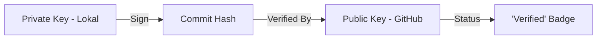

# CH-01: PGP Keys & Cryptographic Verification

> **"Dalam sejarah terdistribusi, identitas harus dapat dibuktikan secara matematis."**

## 🔗 1. Source Link
- [Managing Commit Signature Verification (GitHub Docs)](https://docs.github.com/en/authentication/managing-commit-signature-verification)

## 📖 2. Penjelasan (The What & The Why)
Tanpa GPG (GNU Privacy Guard), siapa pun bisa mengubah `user.name` dan `user.email` di Git lokal untuk menyamar sebagai orang lain. **GPG Signing** menggunakan kunci kriptografi privat untuk menandatangani setiap commit secara digital. Di GitHub, ini ditunjukkan dengan lencana hijau `Verified`, memberikan kepastian bahwa perubahan tersebut benar-benar berasal dari sumber yang sah.

## 🏗️ 3. Architecture Concept: The Royal Seal
Bayangkan sebuah **Surat Kerajaan**. Siapa pun bisa menulis surat dan mengaku sebagai Raja. Namun, hanya surat yang memiliki **Stempel Cincin Kerajaan** (Segel Lilin) yang dianggap sah. GPG adalah cincin kerajaan digital Anda yang menjamin integritas dan autentikasi pada sejarah kode (DAG).

## 📊 4. Visual Graph (Mermaid)
Alur Verifikasi Tanda Tangan:



## 🛠️ 5. Under-the-hood Mechanics
Saat melakukan signing, Git menyisipkan blok tanda tangan digital ke dalam metadata objek **Commit**. Karena Hash SHA-1 dari commit bergantung pada kontennya (termasuk tanda tangan ini), memalsukan identitas penulis tanpa merusak integritas graf adalah hal yang mustahil secara matematis.

## 🧪 6. Practical CLI Lab
Cara melakukan identifikasi kunci dan signing:

```bash
# Melihat daftar kunci GPG yang tersedia
gpg --list-secret-keys --keyid-format LONG

# Mengaktifkan signing otomatis di level sistem
git config --global commit.gpgsign true

# Melakukan commit dengan tanda tangan manual
git commit -S -m "feat: signed commit for security integrity"
```

## 🤝 7. Team Impact (Social Governance)
Penggunaan GPG adalah bagian dari **Zero Trust Architecture**. Tim keamanan dapat memberlakukan kebijakan *Branch Protection* di GitHub yang menolak semua commit yang tidak memiliki tanda tangan valid, menangkal serangan *impersonation*.

## 🚑 8. The Rescue (Undo Tactics): Missing Key Repair
Jika Anda melakukan push tapi statusnya `Unverified` (Lupa upload kunci publik ke GitHub):
1. Salin kunci publik Anda: `gpg --export --armor <ID_KUNCI>`
2. Masukkan ke profil GitHub -> Settings -> SSH and GPG keys.
3. Commit berikutnya akan otomatis berstatus Verified.
