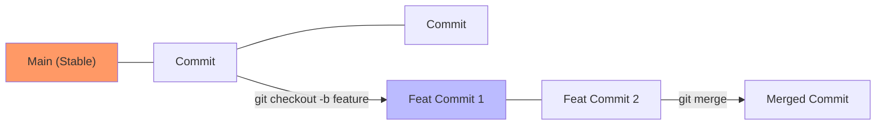

# CH-01: Isolation Workflows (Feature-Driven Branching)

> **"Branching adalah lorong waktu paralel yang murah, gunakanlah untuk mengisolasi inovasi."**

## 🔗 1. Source Link
- [Git Branching - Workflows (Official)](https://git-scm.com/book/en/v2/Git-Branching-Branching-Workflows)

## 📖 2. Penjelasan (The What & The Why)
**Feature Branching** adalah strategi di mana setiap fitur baru, perbaikan bug, atau eksperimen diisolasi sepenuhnya di dalam cabang (*branch*) terpisah. Ini mencegah kode yang belum matang merusak stabilitas jalur produksi utama (**Main**). Setelah fitur tersebut selesai dan diulas, barulah ia digabungkan kembali ke pusat.

## 🏗️ 3. Architecture Concept: The Parallel Universe
Bayangkan Anda adalah seorang arsitek. Anda memiliki **Rumah Utama** yang sudah jadi. Alih-alih langsung merombak dapurnya, Anda membuat **Dapur Virtual** di dimensi paralel. Anda bisa mencoba cat apa pun tanpa mengganggu penghuni rumah. Jika catnya bagus, Anda "memindahkannya" ke rumah asli.

## 📊 4. Visual Graph (Mermaid)
Manajemen Lorong Waktu Fitur:



## 🛠️ 5. Under-the-hood Mechanics: Pointer-based Architecture
Secara internal, sebuah cabang di Git bukanlah salinan file, melainkan hanya sebuah berkas teks kecil berukuran 40 byte di folder `.git/refs/heads/`. Berkas ini berisi Hash SHA-1 dari commit terakhir. Berpindah cabang hanyalah memindahkan penunjuk (**HEAD**) dari satu hash ke hash lainnya.

## 🧪 6. Practical CLI Lab
Cara melakukan isolasi fitur yang rapi:

```bash
# Membuat cabang fitur baru
git checkout -b feat/user-authentication

# Melakukan pekerjaan...
echo "auth_logic" > auth.js
git add auth.js
git commit -m "feat: implement basic social login"

# Berpindah kembali ke main tanpa merusak auth.js tadi
git checkout main
```

## 🤝 7. Team Impact (Social Governance)
Isolasi fitur memungkinkan **Parallel Development**. Puluhan pengembang bisa bekerja pada fitur yang berbeda secara serempak tanpa mencampuri pekerjaan rekan lainnya hingga saat penggabungan tiba.

## 🚑 8. The Rescue (Undo Tactics): Deleting Unwanted Parallelism
Jika eksperimen di cabang fitur ternyata gagal total dan Anda ingin menghapusnya:
```bash
# Menghapus cabang fitur yang tidak diinginkan
git branch -D feat/gagal-total
```
*Tanda '-D' (kapital) memaksa penghapusan meskipun belum digabungkan ke main.*
