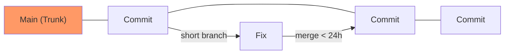

# CH-01: Continuous Integration & Release (Trunk-Based Development)

> **"Jangan biarkan cabang Anda membusuk. Gabungkan segera, rilis lebih cepat."**

## 🔗 1. Source Link
- [Trunk Based Development (Reference)](https://trunkbaseddevelopment.com/)

## 📖 2. Penjelasan (The What & The Why)
**Trunk-Based Development (TBD)** adalah model alur kerja di mana pengembang berkolaborasi pada satu cabang utama (disebut `trunk` atau `main`) dan menghindari cabang fitur berumur panjang. TBD adalah standar emas untuk **Continuous Integration (CI)** karena meminimalkan "Merge Hell" dan memastikan bahwa kode selalu dalam kondisi siap rilis.

## 🏗️ 3. Architecture Concept: The High-Speed Train
Bayangkan sebuah **Kereta Cepat**. Kereta ini terus bergerak maju di jalur utama (main). Penumpang (fitur) harus naik dan turun dengan cepat di stasiun. Jika ada fitur yang terlalu berat atau lambat untuk naik, kereta tidak akan menunggu. Dengan TBD, integrasi dilakukan dalam hitungan jam, bukan minggu.

## 📊 4. Visual Graph (Mermaid)
Aliran Garis Lurus Trunk-Based:



## 🛠️ 5. Under-the-hood Mechanics: Feature Flags
Karena semua kode (termasuk yang belum selesai) masuk ke `main`, TBD sering menggunakan **Feature Flags**. Kode fitur baru ada di pangkalan data Git dan di-deploy ke server, tetapi "saklar"-nya dalam kondisi mati (off) sehingga tidak terlihat oleh pengguna hingga benar-benar siap.

## 🧪 6. Practical CLI Lab
Mensimulasikan integrasi cepat ke main:

```bash
# Selalu tarik perubahan terbaru sebelum bekerja
git pull origin main

# Lakukan perubahan kecil
echo "small_fix" >> styles.css
git add styles.css
git commit -m "fix: tiny adjustment to header padding"

# Langsung kirim ke main
git push origin main
```

## 🤝 7. Team Impact (Social Governance)
TBD membutuhkan **senioritas dan disiplin tinggi**. Tim harus memiliki pengujian otomatis (Unit Tests) yang sangat kuat karena setiap commit langsung berdampak pada jalur produksi utama.

## 🚑 8. The Rescue (Undo Tactics): Fast Revert
Jika sebuah commit di `main` menyebabkan kegagalan sistem, strateginya adalah **Revert Fast**:
```bash
# Kembalikan kondisi main ke commit stabil sebelumnya
git revert HEAD
git push origin main
```
*Jangan mencoba memperbaiki bug langsung di main saat sistem down; kembalikan ke versi stabil terlebih dahulu.*
