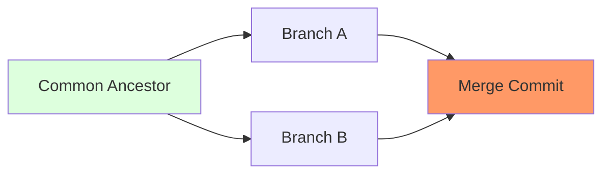

# CH-01: Common Ancestor Logic (The Geometry of Merging)

> **"Git menemukan titik temu di mana sejarah mulai bercabang."**

## 🔗 1. Source Link
- [Git Tools - Advanced Merging (Official)](https://git-scm.com/book/en/v2/Git-Tools-Advanced-Merging)

## 📖 2. Penjelasan (The What & The Why)
Saat Anda menggabungkan dua cabang, Git menggunakan mekanisme **3-Way Merge**. Ia tidak hanya membandingkan dua cabang tersebut, melainkan mencari satu titik di masa lalu di mana kedua cabang tersebut masih menjadi satu. Titik ini disebut **Common Ancestor** (Leluhur Bersama). Pengetahuan ini sangat krusial bagi Senior Dev untuk memahami *kenapa* konflik terjadi.

## 🏗️ 3. Architecture Concept: The Fork in the Road
Bayangkan dua orang petualang berjalan bersama. Di sebuah pertigaan (**Common Ancestor**), mereka berpisah ke jalan yang berbeda. Saat mereka ingin bertemu kembali (Merge), mereka harus membandingkan catatan mereka dengan kondisi jalan terakhir saat mereka masih bersama.

## 📊 4. Visual Graph (Mermaid)
Geometri 3-Way Merge:



## 🛠️ 5. Under-the-hood Mechanics
Git menggunakan algoritma **Recursive Merge** secara default. Ia menghitung selisih (diff) antara:
1. `Ancestor` & `Branch A`
2. `Ancestor` & `Branch B`
Jika kedua cabang mengubah baris yang berbeda, Git bisa menggabungkannya secara otomatis. Jika mereka mengubah baris yang sama, terjadilah **Conflict**.

## 🧪 6. Practical CLI Lab
Mari menemukan leluhur bersama dari dua cabang:

```bash
# Menemukan Hash commit di mana cabang 'feature' terpisah dari 'main'
git merge-base main feature
```

## 🤝 7. Team Impact (Social Governance)
Memahami *Common Ancestor* membantu tim dalam menjaga **Clean History**. Jika leluhur bersama sudah terlalu jauh (drift), disarankan untuk melakukan `merge` dari main ke feature secara berkala agar konflik tidak menumpuk di akhir.

## 🚑 8. The Rescue (Undo Tactics): Aborting the Merge
Jika saat melakukan merge terjadi terlalu banyak konflik yang membingungkan, Anda bisa membatalkannya dan kembali ke kondisi bersih:
```bash
# Membatalkan proses merge yang sedang berlangsung
git merge --abort
```
