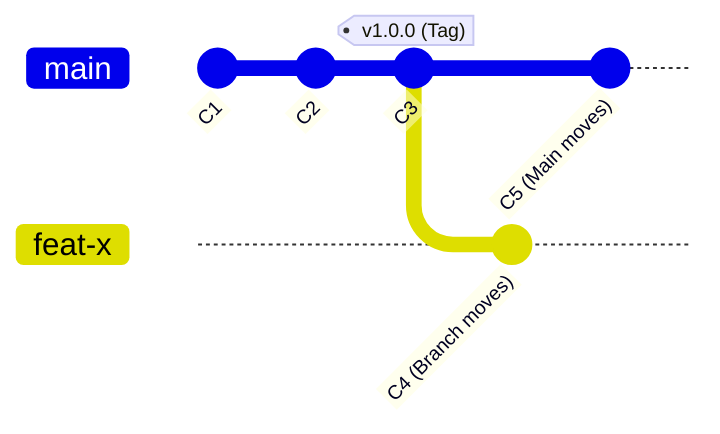

# CH-01: Tag Types (Lightweight vs Annotated)

> **"Tag adalah penanda waktu yang statis; pahami mekanikanya agar tidak sekadar memberi nama."**

---

## 🔗 1. Source Link
- [Git Basics - Tagging (Official)](https://git-scm.com/book/en/v2/Git-Basics-Tagging)
- [Git Internals - Git References](https://git-scm.com/book/en/v2/Git-Internals-Git-References)

---

## 📖 2. Penjelasan (The What & The Why)
**Git Tag** digunakan untuk menandai titik spesifik dalam sejarah repositori sebagai sesuatu yang penting, seperti rilis versi (`v1.0.0`). Berbeda dengan branch yang terus bergerak maju saat ada commit baru, Tag tetap menempel pada satu commit spesifik selamanya (kecuali dihapus).

---

## 🏗️ 3. Architecture Concept: The Bookmark
Bayangkan repositori Anda adalah sebuah **Buku Novel**. 
*   **Branch** adalah "Halaman Terakhir yang Dibaca" (selalu berubah saat Anda membaca).
*   **Tag** adalah "Pembatas Buku" yang Anda selipkan di Bab-10 karena ada kutipan menarik. Pembatas itu tidak akan berpindah halaman meskipun Anda lanjut membaca ke Bab-11.

---

## 📊 4. Visual Graph (Mermaid)
Perbedaan perilaku Branch vs Tag:



---

## 🛠️ 5. Under-the-hood Mechanics: Pointer vs Object
Secara internal, Git membedakan dua jenis tag di folder `.git/refs/tags/`:

1.  **Lightweight Tag**: Hanya sebuah file teks berisi 40 karakter SHA-1 commit. Sangat mirip dengan branch, tapi tidak pernah berubah.
2.  **Annotated Tag**: Disimpan sebagai **objek penuh** dalam database Git. Ia memiliki checksum sendiri, berisi nama pembuat, email, tanggal, pesan tag, dan bisa ditandatangani dengan GPG.

---

## 🧪 6. Practical CLI Lab
Cobalah mekanika pembuatan kedua jenis tag ini:

```bash
# 1. Membuat Lightweight Tag (Cepat & Sederhana)
git tag v1.0.0-lw

# 2. Membuat Annotated Tag (Rekomendasi untuk Rilis)
git tag -a v1.0.0 -m "Release version 1.0.0: Stable production"

# 3. Melihat detail Annotated Tag
git show v1.0.0
```

---

## 🤝 7. Team Impact (Social Governance)
Dalam tim profesional, **Annotated Tags** adalah standar wajib untuk Rilis. Mengapa? Karena ia mencatat **siapa** yang melakukan rilis dan **kapan**, memberikan akuntabilitas yang tidak dimiliki oleh Lightweight Tag.

---

## 🚑 8. The Rescue (Undo Tactics): Retagging
Jika Anda salah menempelkan tag pada commit yang salah:
```bash
# Hapus tag lokal
git tag -d v1.0.0

# Buat ulang di commit yang benar (Gunakan Hash Commit)
git tag -a v1.0.0 [commit-hash] -m "Corrected Release"

# Update di remote (Force push tag)
git push origin :refs/tags/v1.0.0
git push origin v1.0.0
```

---
*Buku ini mengikuti standar **GMGS** di level Chapter.*
