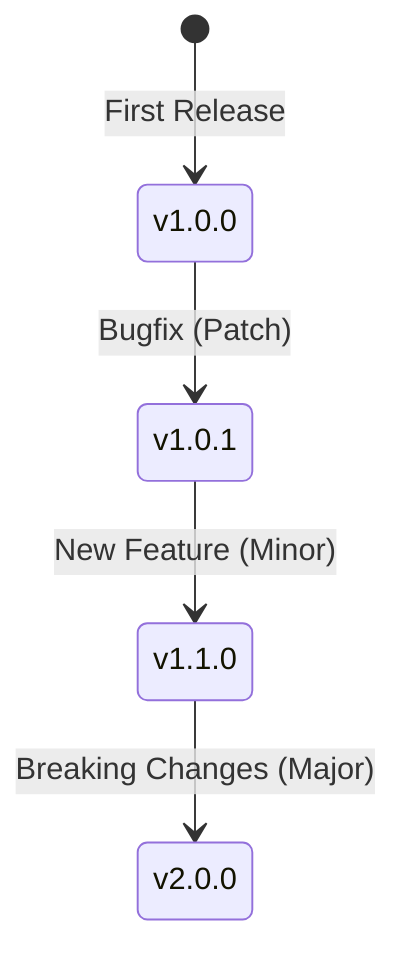

# CH-01: SemVer Standard (Major.Minor.Patch)

> **"Penomoran versi bukan urutan acak; itu adalah kontrak kepercayaan dengan pengguna."**

---

## 🔗 1. Source Link
- [Semantic Versioning 2.0.0 (Official)](https://semver.org/)
- [NPM: About Semantic Versioning](https://docs.npmjs.com/about-semantic-versioning)

---

## 📖 2. Penjelasan (The What & The Why)
**Semantic Versioning (SemVer)** adalah sistem penomoran rilis yang memberikan makna pada setiap angka versi. Tujuannya adalah untuk memberi tahu pengguna perangkat lunak tentang **dampak perubahan** yang terjadi di dalam kode tanpa mereka harus membaca seluruh log commit.

---

## 🏗️ 3. Architecture Concept: The Contract
Bayangkan versi perangkat lunak Anda adalah sebuah **Kontrak Layanan**.
1.  **Major**: Perubahan yang membatalkan kontrak (perlu tanda tangan baru/perbaikan besar).
2.  **Minor**: Tambahan layanan baru dalam kontrak (menguntungkan, tanpa gangguan).
3.  **Patch**: Perbaikan kesalahan teknis kecil (tidak mengubah butir kontrak).

---

## 📊 4. Visual Graph (Mermaid)
Logika Aliran Versi:



---

## 🛠️ 5. Under-the-hood Mechanics: Breaking Changes
Kenapa angka **Major** begitu sakral? Dalam arsitektur sistem (API/Library), menaikkan angka Major berarti menghapus atau mengubah fungsi publik yang ada sehingga kode lama tidak lagi berfungsi. Jika Anda mengubah nama fungsi dari `getUser()` menjadi `fetchUser()`, Anda **HARUS** menaikkan angka Major (e.g., `1.2.3` -> `2.0.0`).

---

## 🧪 6. Practical CLI Lab
Melakukan simulasi rilis dengan tagging SemVer di terminal:

```bash
# Skenario 1: Bugfix (v1.0.0 -> v1.0.1)
git tag -a v1.0.1 -m "fix: resolve memory leak in header"

# Skenario 2: Fitur Baru (v1.0.1 -> v1.1.0)
git tag -a v1.1.0 -m "feat: add user profile picture support"

# Skenario 3: Perubahan Besar (v1.1.0 -> v2.0.0)
git tag -a v2.0.0 -m "BREAKING: migration to new database schema"
```

---

## 🤝 7. Team Impact (Social Governance)
Menerapkan SemVer memaksa tim untuk disiplin dalam **Backward Compatibility**. Jika tim sepakat menggunakan SemVer, tidak boleh ada kejutan pahit bagi pengguna saat mereka melakukan update versi minor atau patch.

---

## 🚑 8. The Rescue (Undo Tactics): Release Deletion
Jika Anda terlanjur merilis versi (Tag) yang ternyata memiliki bug fatal:
```bash
# Jangan ubah isi kode di v1.2.0 (Tag itu suci/immutable)
# Melainkan, buat patch baru secepatnya
git tag -a v1.2.1 -m "HOTFIX: emergency patch for v1.2.0"
```
*Aturan Emas: Jangan pernah "memaksakan" (force push) konten baru ke tag yang sudah ada. Buatlah versi baru.*

---
*Buku ini mengikuti standar **GMGS** di level Chapter.*
