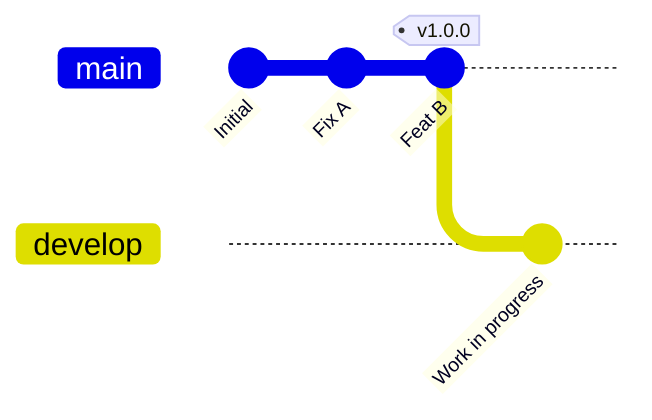

# 🔖 SR-03: Tagging & Versioning Strategy

> **"Tagging adalah segel keabadian pada momen sejarah kode yang tepat."**

Sub-rak ini membahas bagaimana menandai titik-titik krusial dalam sejarah repositori (milestones) dan bagaimana menggunakan sistem penomoran versi yang standar industri.

---

## 🧭 Navigasi Materi (Buku)

| Code | Buku | Fokus Materi | Link |
| :--- | :--- | :--- | :--- |
| 📖 **BK-01** | **Git Tagging Mechanics** | Perbedaan Annotated vs Lightweight Tags. | **[Buka Buku](./BK-01-Git-Tagging-Mechanics/)** |
| 📖 **BK-02** | **Versioning Philosophy** | Implementasi Semantic Versioning (SemVer) 2.0.0. | **[Buka Buku](./BK-02-Versioning-Philosophy/)** |

---

## 🏛️ Arsitektur Konsep: The Immutable Snapshot
Tag di Git bukanlah branch. Jika branch adalah "garis waktu yang mengalir", maka Tag adalah "paku" yang menancap pada satu commit spesifik. Tag bersifat **Immutable** (tidak seharusnya dipindahkan atau diubah kontennya).

### Visualisasi: Tag dalam DAG (Mermaid)


---

## ⚓ Git Mastery Gold Standard (GMGS)

### 1. Source Link
- [Official Git Docs - Tagging](https://git-scm.com/book/en/v2/Git-Basics-Tagging)
- [Semantic Versioning 2.0.0](https://semver.org/)

### 2. Under-the-hood Mechanics
Internal Git menyimpan tag sebagai file di `.git/refs/tags/`. 
- **Lightweight**: Hanya berisi SHA-1 commit.
- **Annotated**: Disimpan sebagai objek penuh (seperti commit) yang berisi nama pembuat, tanggal, dan pesan.

### 3. Practical CLI Lab
```bash
# Membuat annotated tag
git tag -a v1.0.0 -m "Release v1.0.0: Core Features"

# Melihat riwayat tag
git tag

# Mengirim tag ke remote
git push origin v1.0.0
```

### 4. The Rescue (Undo Tactics)
Jika salah menandai:
```bash
# Hapus tag lokal
git tag -d v1.0.0
# Hapus tag remote
git push --delete origin v1.0.0
```

---
*Materi ini merupakan bagian dari **RAK-03: Evolution & Interfacing**.*
