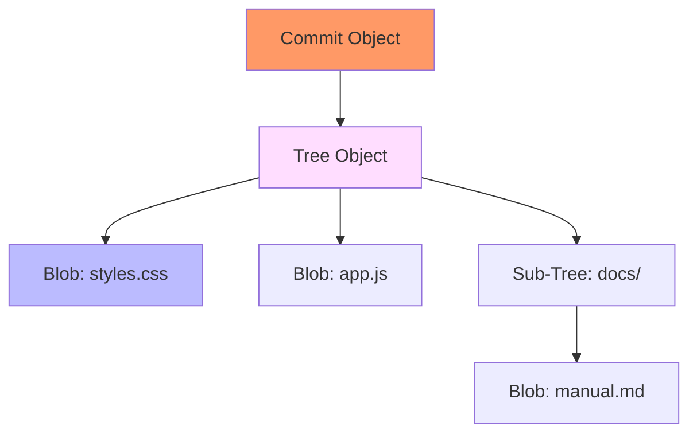

# CH-01: Blobs, Trees, & Commits (The Internal Trinity)

> **"Git bukan sekadar pelacak file; ia adalah database objek berbasis konten."**

## 🔗 1. Source Link
- [Git Internals - Git Objects (Official)](https://git-scm.com/book/en/v2/Git-Internals-Git-Objects)

## 📖 2. Penjelasan (The What & The Why)
Di jantung Git, semuanya adalah **Objek**. Hanya ada tiga jenis objek utama yang membangun sejarah Anda:
1. **Blob (Binary Large Object)**: Hanya menyimpan isi file (tanpa nama file atau izin).
2. **Tree**: Menyimpan struktur direktori, menghubungkan nama file dengan Hash Blob, atau merujuk ke Tree lain (sub-direktori).
3. **Commit**: Mengikat satu Tree (snapshot seluruh proyek) dengan metadata (penulis, penanda waktu, pesan, dan rujukan ke commit induk).

## 🏗️ 3. Architecture Concept: The Content-Addressable Filing Cabinet
Bayangkan sebuah **Lemari Arsip** raksasa. Anda tidak memberi label laci dengan nama file, melainkan dengan **Sidik Jari** (Hash) dari isinya. Jika dua file memiliki isi yang sama, mereka berbagi satu sidik jari yang sama di dalam lemari. Ini membuat Git sangat efisien dalam menyimpan data yang berulang.

## 📊 4. Visual Graph (Mermaid)
Anatomi Objek Git:



## 🛠️ 5. Under-the-hood Mechanics: Zlib & SHA-1
Setiap objek dikompresi menggunakan **Zlib** sebelum disimpan di folder `.git/objects`. Nama filenya adalah Hash **SHA-1** 40 karakter dari konten mentah ditambah header tipe objek. Dua karakter pertama menjadi nama folder, dan 38 sisanya menjadi nama file.

## 🧪 6. Practical CLI Lab
Mari membuat objek secara manual (Plumbing):

```bash
# Membuat objek blob
echo "hello world" | git hash-object -w --stdin

# Melihat tipe objek dari hash (ambil 4 char pertama saja cukup jika unik)
git cat-file -t <hash>

# Melihat isi objek secara manusiawi
git cat-file -p <hash>
```

## 🤝 7. Team Impact (Social Governance)
Arsitektur berbasis objek ini menjamin **Integritas Sejarah**. Karena commit merujuk pada hash Tree, dan Tree merujuk pada hash Blob, tidak ada satu bit pun yang bisa diubah tanpa mengubah seluruh hash commit ke atas (DAG). Ini membuat sabotase sejarah sangat mudah dideteksi.

## 🚑 8. The Rescue (Undo Tactics): Dangling Objects
Jika Anda tidak sengaja menghapus commit yang belum dipush, objeknya mungkin masih ada di `.git/objects` sebagai objek yang menggantung (*dangling*). Anda bisa menemukannya dengan:
```bash
git fsck --lost-found
```
*Gunakan hash yang ditemukan untuk mengintip kembali isinya via `git cat-file -p`.*
