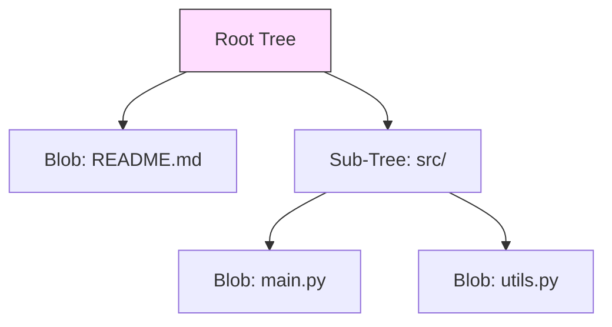

# SC-02: Tree Hierarchy Logic (The Structural Map)

> **"Jika Blob adalah datanya, maka Tree adalah arsitekturnya."**

## 🔗 1. Source Link
- [Git Objects - Trees](https://git-scm.com/book/en/v2/Git-Internals-Git-Objects)

## 📖 2. Penjelasan (The What & The Why)
Objek **Tree** menyelesaikan masalah yang ditinggalkan oleh Blob: di mana nama file disimpan? Tree bertindak seperti direktori; ia memetakan nama file ke Hash Blob yang sesuai, dan juga bisa merujuk ke Tree lain untuk mewakili sub-direktori.

## 🏗️ 3. Architecture Concept: The Instruction Manual
Bayangkan sebuah **Instruksi Perakitan LEGO**. Blob adalah bata-bata individunya. Tree adalah buku panduan yang memberi tahu Anda: "Bata Merah (Hash A) pasang di posisi X (nama file: `index.html`)". Tanpa Tree, Anda hanya punya tumpukan data tanpa struktur.

## 📊 4. Visual Graph (Mermaid)
Struktur Tree Menghubungkan Objek:



## 🛠️ 5. Under-the-hood Mechanics
Isi dari objek Tree adalah daftar entri biner. Setiap entri terdiri dari:
- **Mode**: Hak akses file (misal: 100644 untuk file biasa).
- **Type**: `blob` atau `tree`.
- **SHA-1**: Hash 20-byte dari objek yang dirujuk.
- **Path**: Nama file atau direktori.

## 🧪 6. Practical CLI Lab
Mengintip isi Tree secara manual:

```bash
# Melihat tree yang dirujuk oleh commit terakhir
git ls-tree HEAD

# Melihat isi mentah objek tree (format plumbing)
# git cat-file -p <tree_hash>
```

## 🤝 7. Team Impact (Social Governance)
Tree memungkinkan Git melakukan **Fast Rename Detection**. Jika Anda memindahkan file tanpa mengubah isinya, Hash Blob-nya tetap sama, hanya entri di Tree yang berubah. Ini memberitahu rekan tim bahwa file hanya berpindah tempat, bukan dihapus dan dibuat ulang, menjaga riwayat `git blame` tetap utuh.

## 🚑 8. The Rescue (Undo Tactics): Reconstructing from Trees
Jika Anda kehilangan file tetapi tahu hash Tree-nya, Anda bisa membangun kembali seluruh struktur direktori tersebut menggunakan perintah `git read-tree`.
