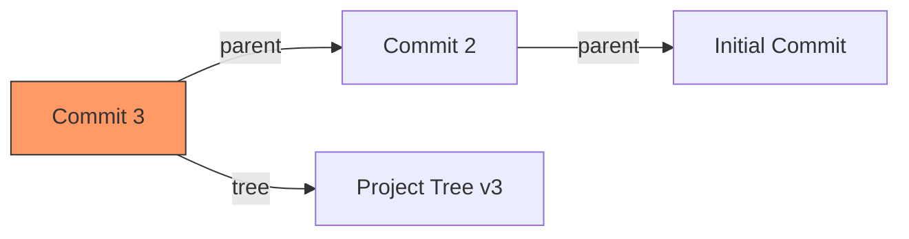

# SC-03: Commit Graph Integrity (The Temporal Anchor)

> **"Commit adalah simpul yang mengikat ruang (Snapshot) dan waktu (Parent)."**

## 🔗 1. Source Link
- [Git Objects - Commits](https://git-scm.com/book/en/v2/Git-Internals-Git-Objects)

## 📖 2. Penjelasan (The What & The Why)
Objek **Commit** adalah unit yang memberikan konteks pada sebuah snapshot. Ia menjawab: "Siapa yang melakukan perubahan ini, kapan, mengapa, dan apa dasar (parent) dari perubahan ini?". Commit adalah elemen yang membentuk **Directed Acyclic Graph (DAG)** dalam Git.

## 🏗️ 3. Architecture Concept: The Time Capsule
Bayangkan sebuah **Kapsul Waktu**. Di dalamnya ada foto seluruh kota (Tree), catatan tentang siapa yang menguburnya (Author), jam berapa dikubur, dan pesan untuk masa depan. Kapsul ini juga memiliki rantai yang terikat ke kapsul sebelumnya (Parent), sehingga kita bisa menelusuri sejarah kota dari awal hingga akhir.

## 📊 4. Visual Graph (Mermaid)
Hubungan Commit ke Snapshot:



## 🛠️ 5. Under-the-hood Mechanics
Format objek commit sangat sederhana (teks polos sebelum dikompres):
```text
tree <sha1_tree>
parent <sha1_parent>
author <name> <email> <timestamp>
committer <name> <email> <timestamp>

<commit message>
```

## 🧪 6. Practical CLI Lab
Membedah commit terakhir:

```bash
# Melihat isi mentah objek commit
git cat-file -p HEAD

# Melihat rantai induk secara visual
git log --graph --oneline
```

## 🤝 7. Team Impact (Social Governance)
Metadata commit adalah fondasi **Akuntabilitas**. Dengan informasi *Author* dan *Committer* yang berbeda, kita bisa melacak siapa yang menulis kode asli vs siapa yang menggabungkannya ke cabang utama (misal: saat proses rebase atau maintainer merespon PR).

## 🚑 8. The Rescue (Undo Tactics): Finding the Lost Parent
Jika Anda kehilangan rujukan cabang (Dangling Commit), commit tersebut tetap ada di database sampai dibersihkan oleh `garbage collection`. Anda bisa menggunakan `git reflog` atau `git fsck` untuk menemukan hash commit tersebut dan mengikatnya kembali ke cabang baru.
