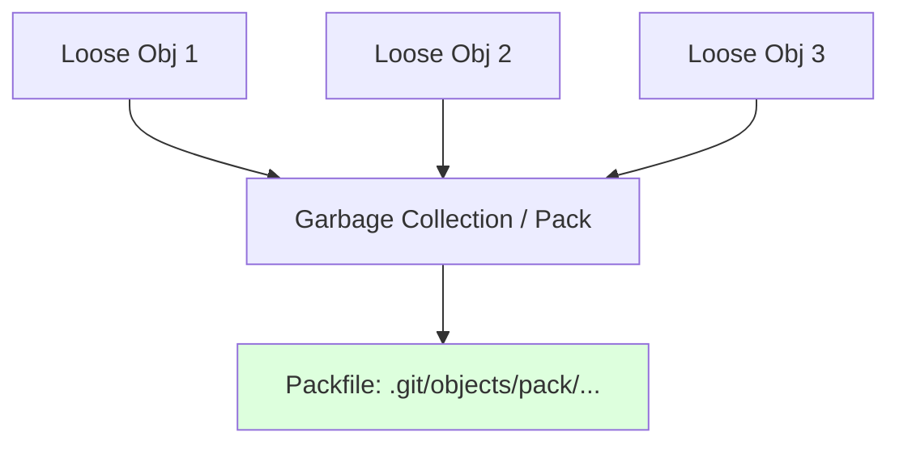

# CH-01: Delta Compression Mechanics (The Physics of Packfiles)

> **"Git menyimpan snapshot, tapi ia terlalu cerdik untuk menyimpan data yang sama berulang kali."**

## 🔗 1. Source Link
- [Git Internals - Packfiles (Official)](https://git-scm.com/book/en/v2/Git-Internals-Packfiles)

## 📖 2. Penjelasan (The What & The Why)
Awalnya, Git menyimpan setiap versi file sebagai objek terpisah (**Loose Objects**). Namun, ini akan memakan banyak ruang jika file sering berubah sedikit demi sedikit. Git menggunakan mekanisme **Packfiles** untuk mengelompokkan banyak objek ke dalam satu file binary besar dan menggunakan **Delta Compression**—hanya menyimpan satu versi utuh dan sisanya hanya "selisih"-nya saja terhadap versi tersebut.

## 🏗️ 3. Architecture Concept: The Moving Shadow
Bayangkan sebuah **Wayang Kulit**. Versi asli adalah wayang utuh. Versi berikutnya mungkin hanya menggerakkan tangannya sedikit. Daripada membuat satu wayang baru seutuhnya, Git hanya mencatat "posisi tangan bergeser 5cm". Ini menghemat ruang penyimpanan secara drastis sambil tetap mempertahankan ilusi "snapshot utuh".

## 📊 4. Visual Graph (Mermaid)
Transformasi Loose Objects ke Packfile:



## 🛠️ 5. Under-the-hood Mechanics
Git secara berkala menjalankan `git gc` (Garbage Collection). Ia akan mencari file yang serupa, menghitung delta-nya, dan mengompresinya ke dalam format `.pack`. Git sangat cerdik; ia sering menyimpan versi *terbaru* sebagai versi utuh dan versi *lama* sebagai delta, karena versi terbaru biasanya lebih sering diakses (akses cepat).

## 🧪 6. Practical CLI Lab
Mari melihat statistik objek dan melakukan optimasi manual:

```bash
# Melihat berapa banyak objek yang belum masuk ke packfile
git count-objects -v

# Menjalankan optimasi manual untuk memampatkan objek
git gc --prune=now --aggressive

# Melihat isi packfile (informasi meta)
# git verify-pack -v .git/objects/pack/pack-*.idx
```

## 🤝 7. Team Impact (Social Governance)
Otomatisasi Packfile memastikan repository tetap **Ringan di Jaringan**. Saat Anda melakukan `git fetch`, Git hanya mengirimkan packfile yang berisi delta perubahan, bukan seluruh file project. Ini sangat krusial untuk tim besar dengan ribuan commit.

## 🚑 8. The Rescue (Undo Tactics): Pruning Objects
Jika repository Anda terasa sangat berat karena file besar yang sudah dihapus masih ada di dalam objects, Anda mungkin butuh memaksa Git membersihkan objek yang tidak terpakai:
```bash
# Berbahaya: Pastikan tidak ada pekerjaan yang belum di-commit
git gc --prune=now
```
