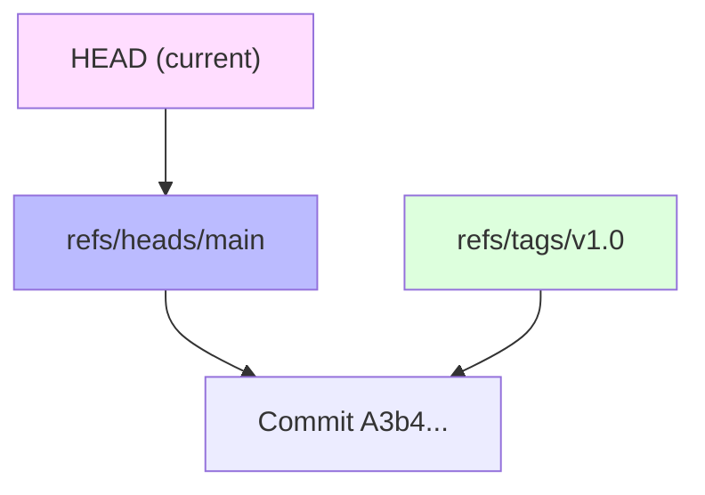

# CH-01: Pointer Anatomy (Refs, Heads & Tags)

> **"Di dalam Git, sebuah cabang hanyalah secarik kertas kecil berisi alamat commit terakhir."**

## 🔗 1. Source Link
- [Git Internals - Git References (Official)](https://git-scm.com/book/en/v2/Git-Internals-Git-References)

## 📖 2. Penjelasan (The What & The Why)
Git melacak lokasinya di dalam sejarah (DAG) melalui **References (Refs)**. Refs adalah file teks sederhana di dalam folder `.git/refs/` yang berisi 40 karakter Hash SHA-1.
- **Heads**: Penunjuk ke ujung cabang lokal.
- **Tags**: Penunjuk permanen ke commit spesifik (untuk rilis).
- **HEAD**: File khusus yang menunjuk ke cabang mana Anda berada sekarang.

## 🏗️ 3. Architecture Concept: The Signpost
Bayangkan sebuah **Padang Pasir** yang luas (Object Database). Setiap butiran pasir adalah commit. Untuk bernavigasi, Anda menanam **Papan Penunjuk Jalan** (Refs). Sebuah cabang adalah penunjuk jalan yang berpindah setiap kali ada pasir baru diletakkan di depannya. Sebuah tag adalah penunjuk jalan yang dipaku permanen ke satu butir pasir.

## 📊 4. Visual Graph (Mermaid)
Anatomi Penunjuk (Pointer) Git:



## 🛠️ 5. Under-the-hood Mechanics
Refs adalah komponen **Plumbing** paling dasar. Saat Anda mengetik `git branch feature`, Git hanya melakukan:
`echo <hash_head_sekarang> > .git/refs/heads/feature`
Sangat murah secara komputasi, itulah sebabnya membuat ribuan cabang di Git tidak memberatkan sistem.

## 🧪 6. Practical CLI Lab
Mari melihat isi fisik dari penunjuk cabang:

```bash
# Melihat di mana HEAD menunjuk saat ini
cat .git/HEAD

# Melihat isi hash yang disimpan oleh cabang main
cat .git/refs/heads/main

# Melihat seluruh penunjuk (branches & tags) dalam satu daftar
git show-ref
```

## 🤝 7. Team Impact (Social Governance)
Pemisahan antara `Heads` lokal dan pemetaan rilis di `Tags` memungkinkan tim untuk melakukan **Release Management** yang rapi. Versi produksi selalu ditandai dengan Tag yang imutabel, sehingga tim selalu tahu titik mana yang aman untuk di-deploy.

## 🚑 8. The Rescue (Undo Tactics): Manual Ref Update
Jika penunjuk cabang Anda rusak atau Anda ingin memindahkan cabang secara paksa ke commit lain tanpa checkout:
```bash
# Perintah teknis tingkat tinggi (Plumbing) untuk memindahkan penunjuk cabang
git update-ref refs/heads/main <new_hash>
```
*Gunakan dengan sangat hati-hati karena ini mengubah sejarah secara paksa.*
