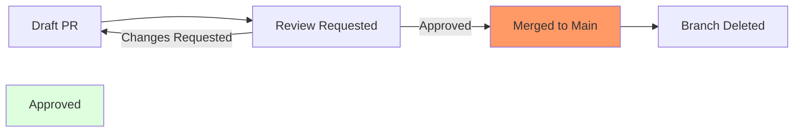

# CH-01: Code Review Standards (The Gatekeeper Policy)

> **"Code Review bukan ajang mencari kesalahan, melainkan proses kolektif menjaga integritas arsitektur."**

## 🔗 1. Source Link
- [About Pull Request Reviews (GitHub Docs)](https://docs.github.com/en/pull-requests/collaborating-with-pull-requests/reviewing-changes-in-pull-requests/about-pull-request-reviews)

## 📖 2. Penjelasan (The What & The Why)
**Code Review** adalah proses di mana satu atau lebih anggota tim memeriksa Pull Request (PR) sebelum digabungkan ke cabang utama. Tujuannya adalah untuk memastikan kode mematuhi standar kualitas, tidak memiliki celah keamanan, dan selaras dengan visi teknis proyek. Ini adalah filter utama dalam tata kelola kolaborasi asinkron.

## 🏗️ 3. Architecture Concept: The Gatekeeper
Bayangkan sebuah **Benteng Pertahanan**. Setiap orang boleh membawakan material baru, tetapi sebelum dipasang di dinding utama, material tersebut harus diperiksa oleh **Penjaga Gerbang** (Reviewer). Penjaga memastikan materialnya kuat (performa) dan cocok dengan desain benteng (konvensi kode).

## 📊 4. Visual Graph (Mermaid)
Siklus Hidup Pull Request & Review:



## 🛠️ 5. Under-the-hood Mechanics
Secara internal, GitHub menghitung *diff* antara cabang sumber dan cabang target. GitHub tidak hanya menampilkan perbedaan teks, tetapi juga melacak komentar pada baris kode tertentu. Metadata ini disimpan di database GitHub dan dihubungkan dengan ID Pull Request yang bersifat unik di tingkat repository.

## 🧪 6. Practical CLI Lab
Berinteraksi dengan PR melalui terminal (menggunakan GitHub CLI):

```bash
# Melihat daftar PR yang masuk
gh pr list

# Mengambil (checkout) PR spesifik untuk dicoba secara lokal
gh pr checkout <pr_number>

# Memberikan komentar review secara cepat
# gh pr review --comment -b "Good work, but consider renaming this function."
```

## 🤝 7. Team Impact (Social Governance)
Standardisasi review menciptakan budaya **Knowledge Sharing**. Anggota tim junior belajar dari saran senior, dan senior tetap terinformasi tentang perubahan terbaru di bagian lain dari codebase. Ini mencegah adanya "Code Ownership" yang berlebihan (di mana hanya satu orang yang paham modul tertentu).

## 🚑 8. The Rescue (Undo Tactics): Reverting a Merged PR
Jika sebuah PR yang sudah di-merge ternyata merusak sistem di produksi:
1. Buka halaman PR di GitHub.
2. Klik tombol **Revert**.
3. Ini akan membuat PR baru yang isinya adalah kebalikan dari perubahan tadi.
4. Merge PR revert tersebut untuk memulihkan keadaan.
