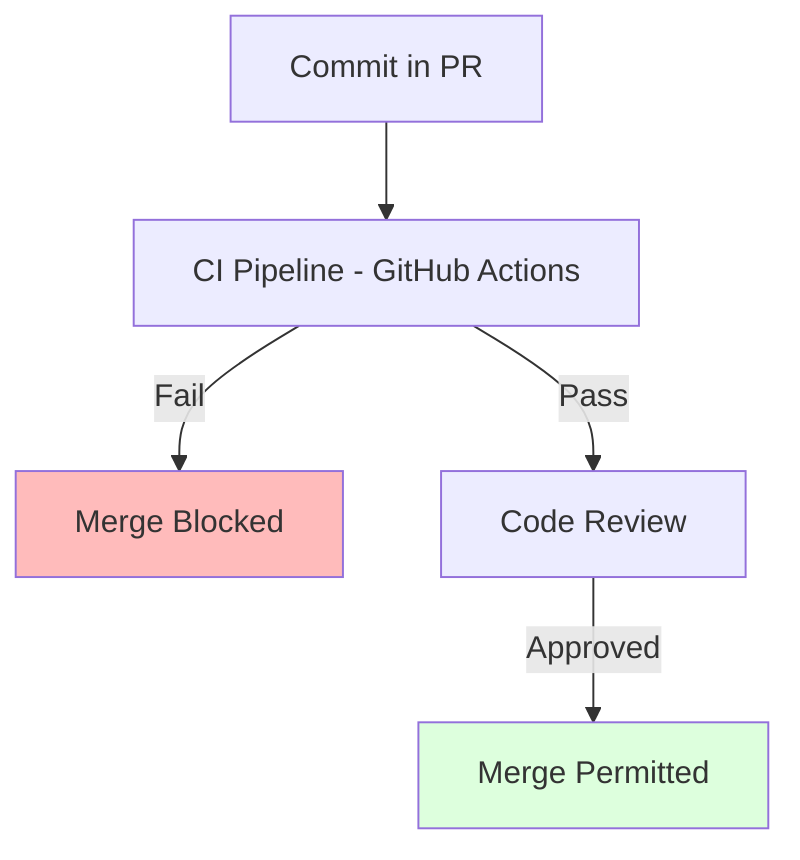

# CH-01: Enforcing Quality Gates (Branch Protection Rules)

> **"Di jalur utama, tidak ada ruang untuk kecerobohan. Lindungi sejarah Anda dengan aturan yang kaku."**

## 🔗 1. Source Link
- [About Protected Branches (GitHub Docs)](https://docs.github.com/en/repositories/configuring-branches-and-merges-in-your-repository/defining-the-mergeability-of-pull-requests/about-protected-branches)

## 📖 2. Penjelasan (The What & The Why)
**Branch Protection** adalah mekanisme keamanan di GitHub untuk mencegah penghapusan cabang secara tidak sengaja atau pengunggahan paksa (*Force Push*) ke cabang kritis seperti `main`. Dengan fitur ini, kita bisa mewajibkan adanya ulasan (*Approval*), pengujian otomatis yang lulus (*Status Checks*), dan tanda tangan digital (GPG) sebelum kode bisa masuk.

## 🏗️ 3. Architecture Concept: The Vault
Bayangkan cabang `main` adalah sebuah **Brankas Emas**. Anda tidak bisa begitu saja memasukkan emas baru ke dalamnya. Anda harus melewati serangkaian **Sensor Keamanan** (CI Tests) dan mendapatkan **Tanda Tangan Dua Pejabat** (Reviewers) sebelum pintu brankas terbuka secara otomatis.

## 📊 4. Visual Graph (Mermaid)
Aliran Verifikasi Branch Protection:



## 🛠️ 5. Under-the-hood Mechanics
GitHub API secara ketat memvalidasi setiap upaya `PATCH` atau `POST` ke jalur `refs/heads/main`. Jika repository memiliki aturan proteksi, server GitHub akan menolak perintah `git push` langsung dari lokal pengembang dan memberikan pesan error `protected branch hook declined`.

## 🧪 6. Practical CLI Lab
Mengecek status proteksi via GitHub CLI:

```bash
# Melihat aturan proteksi pada cabang saat ini
# gh api repos/{owner}/{repo}/branches/main/protection

# Simulasi (Akan ditolak jika proteksi aktif):
# git push origin main --force
```

## 🤝 7. Team Impact (Social Governance)
Menerapkan proteksi memberikan **Ketenangan Pikiran** (Peace of Mind). Tidak perlu khawatir seorang pengembang baru secara tidak sengaja menghapus sejarah produksi. Ini juga menegakkan akuntabilitas karena setiap perubahan pada jalur utama memiliki jejak persetujuan yang jelas.

## 🚑 8. The Rescue (Undo Tactics): Admin Override
Dalam situasi darurat ekstrem (misal: sistem mati total dan perbaikan harus masuk detik ini juga), pemilik repository (Admin) bisa memberikan izin khusus untuk melewati aturan proteksi:
1. Masuk ke Settings -> Branches.
2. Matikan sementara aturan "Include administrators".
3. Lakukan perbaikan darurat.
4. **WAJIB** Segera aktifkan kembali aturan tersebut setelah selesai.
