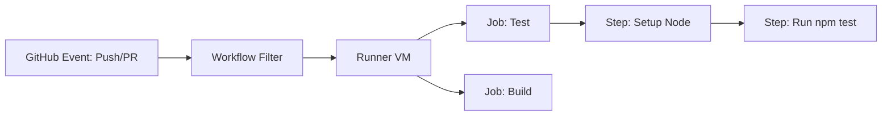

# CH-01: Workflow Syntax & Events (The Automation Blueprint)

> **"Biarkan robot bekerja untuk Anda, sehingga Anda bisa fokus memahat arsitektur."**

## 🔗 1. Source Link
- [Understanding GitHub Actions (Official)](https://docs.github.com/en/actions/learn-github-actions/understanding-github-actions)

## 📖 2. Penjelasan (The What & The Why)
**GitHub Actions** adalah platform otomasi yang memungkinkan Anda menjalankan alur kerja (workflows) langsung di repository Anda berdasarkan kejadian tertentu (*events*), seperti `push`, `pull_request`, atau `schedule`. Workflows ditulis dalam file YAML dan dijalankan pada mesin virtual (Runners) milik GitHub atau milik Anda sendiri.

## 🏗️ 3. Architecture Concept: The Robotics Factory
Bayangkan sebuah **Pabrik Robot**. Setiap kali ada truk (Commit) datang membawa material, robot sensor mendeteksi kedatangan tersebut. Senapan robot (Actions) otomatis memeriksa kualitas cat (linting), kekuatan rangka (testing), dan jika semuanya lulus, robot pengepak (deploy) akan mengirimkan barang ke toko (production). Semuanya berjalan 24/7 tanpa campur tangan manusia.

## 📊 4. Visual Graph (Mermaid)
Anatomi Aliran GitHub Actions:



## 🛠️ 5. Under-the-hood Mechanics
Secara internal, GitHub menggunakan orchestrator yang mengurai (parsing) file YAML di `.github/workflows/`. Ia kemudian mengalokasikan container atau virtual machine (Ubuntu/Windows/macOS), mengunduh kode Anda, dan mengeksekusi urutan perintah yang didefinisikan dalam `steps`. Status setiap langkah dikirimkan kembali ke antarmuka GitHub secara real-time.

## 🧪 6. Practical CLI Lab
Contoh file workflow minimalis (`.github/workflows/hello.yml`):

```yaml
name: Hello World CI
on: [push]
jobs:
  build:
    runs-on: ubuntu-latest
    steps:
      - uses: actions/checkout@v4
      - run: echo "Hello from GitHub Actions!"
```

## 🤝 7. Team Impact (Social Governance)
Actions menegakkan **Quality Assurance (QA)** secara paksa. Tim dapat mengatur agar tombol "Merge" hanya bisa diklik jika semua tes di Actions lulus. Ini menjaga agar kode yang merusak sistem tidak pernah sampai ke tangan pengguna.

## 🚑 8. The Rescue (Undo Tactics): Stopping the Robots
Jika sebuah alur kerja Actions berjalan tanpa henti (infinity loop) atau memakan biaya tinggi:
1. Buka tab **Actions** di GitHub.
2. Cari alur kerja yang sedang berjalan.
3. Klik tombol **Cancel workflow**.
4. Perbaiki file YAML dan lakukan push kembali.
