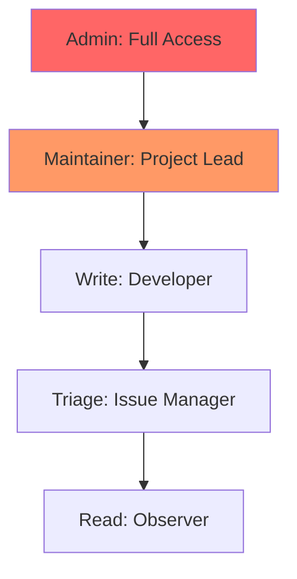

# CH-01: Role-Based Access Control (Organization Security)

> **"Keamanan bukan tentang ketidakinginan berbagi, melainkan tentang pembagian tanggung jawab yang tepat."**

## 🔗 1. Source Link
- [Repository Roles for an Organization (GitHub Docs)](https://docs.github.com/en/organizations/managing-access-to-your-organizations-repositories/repository-roles-for-an-organization)

## 📖 2. Penjelasan (The What & The Why)
**RBAC (Role-Based Access Control)** di GitHub adalah sistem manajemen izin yang memastikan setiap anggota tim memiliki tingkat akses yang tepat sesuai peran mereka. GitHub menyediakan peran standar seperti:
- **Reader**: Hanya bisa melihat kode.
- **Triage**: Bisa mengelola issue dan PR tapi tidak bisa menulis kode.
- **Write**: Bisa mengunggah kode dan mengelola cabang.
- **Maintainer**: Bisa mengelola repository sepenuhnya.
- **Admin**: Akses mutlak (pengaturan, keamanan, penagihan).

## 🏗️ 3. Architecture Concept: The Multi-Floor Building
Bayangkan sebuah **Gedung Perkantoran**. Setiap lantai memiliki tingkat keamanan berbeda.
- Pengunjung (Reader) hanya di lobi.
- Staf (Write) bisa masuk ke ruang kerja.
- Manajer (Maintainer) bisa masuk ke ruang rapat dan Brankas Fitur.
- Pemilik Gedung (Admin) bisa merobohkan dan membangun kembali gedung tersebut.

## 📊 4. Visual Graph (Mermaid)
Hierarki Izin GitHub:



## 🛠️ 5. Under-the-hood Mechanics
Saat seorang pengguna mencoba melakukan aksi (misal: push), GitHub melakukan pengecekan di database internalnya untuk memverifikasi apakah Token Akses (PAT/SSH) pengguna tersebut terhubung dengan peran yang memiliki izin `repo:write`. Jika tidak, server akan mengirimkan respon `403 Forbidden`.

## 🧪 6. Practical CLI Lab
Memeriksa izin diri sendiri via CLI:

```bash
# Mengecek daftar tim di sebuah organisasi
# gh api orgs/{org}/teams

# Mengecek daftar anggota di repository
gh api repos/{owner}/{repo}/collaborators
```

## 🤝 7. Team Impact (Social Governance)
Manajemen peran adalah fondasi **Compliance (Kepatuhan)**. Dalam proyek besar atau di perusahaan, tidak semua orang boleh memiliki akses Admin demi menjaga integritas data dan meminimalkan risiko sabotase atau kebocoran data.

## 🚑 8. The Rescue (Undo Tactics): Offboarding compromised individuals
Jika akun salah satu anggota tim terkompromi (hack) atau ia meninggalkan proyek secara tidak baik:
1. Masuk ke Settings -> Collaborators.
2. Klik tombol **Remove** (tong sampah) di samping namanya.
3. Ini akan segera memutuskan seluruh akses SSH dan Token mereka ke repository.
