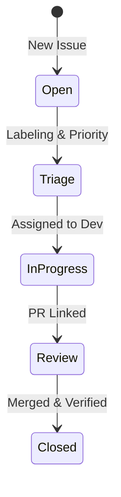

# CH-01: Lifecycle of Truth (From Open to Close)

> **"Issue adalah akar sejarah; kelola dengan klasifikasi atau hadapi kekacauan informasi."**

---

## 🔗 1. Source Link
- [GitHub Docs: Mastering Issues](https://guides.github.com/features/issues/)
- [Standard Issue Labels - Best Practices](https://docs.github.com/en/issues/using-labels)

---

## 📖 2. Penjelasan (The What & The Why)
**Issue Taxonomy** adalah cara kita mengklasifikasikan setiap laporan masalah atau permintaan fitur. Tanpa taksonomi yang jelas, daftar Issue Anda akan menjadi tumpukan sampah digital yang sulit untuk diprioritaskan.

---

## 🏗️ 3. Architecture Concept: The Sorting Hat
Bayangkan Issue Anda adalah sebuah **Surat Masukan** di kotak saran perusahaan besar.
*   **Bug**: "Ada keran bocor!" (Harus diperbaiki secepatnya).
*   **Feature**: "Saya ingin ada taman di atap!" (Ide baru, butuh perencanaan).
*   **Chore**: "Tolong bersihkan jendela." (Pemeliharaan rutin, tidak terlihat oleh pelanggan).

---

## 📊 4. Visual Graph (Mermaid)
Siklus Hidup Sebuah Issue:



---

## 🛠️ 5. Under-the-hood Mechanics: Traceability
Internal GitHub menghubungkan **Issue** dengan **Commit** dan **Pull Request** melalui metadata ID (`#12`). Senior Engineer menjamin **Traceability** (keterlacakan)—bahwa setiap baris kode di `main` memiliki alasan yang terdokumentasi di sebuah Issue.

---

## 🧪 6. Practical CLI Lab
Manajemen taksonomi label via GitHub CLI:

```bash
# Membuat label kustom
gh label create "priority:high" --color "ff0000" --description "Critical fix needed"

# Membuat issue dengan label otomatis
gh issue create --title "bug: login failure on mobile" \
                --body "Deskripsi bug..." \
                --label "bug,priority:high"
```

---

## 🤝 7. Team Impact (Social Governance)
Taksonomi memudahkan **Triage** (pemilahan). Pengembang senior bisa melihat filter `label:bug` dan `label:priority:high` untuk mengetahui apa yang harus dikerjakan hari ini tanpa harus bertanya ke manajer proyek.

---

## 🚑 8. The Rescue (Undo Tactics): Issue Recovery
Jika sebuah Issue terlanjur ditutup padahal masalahnya belum benar-benar selesai:
```bash
# Jangan buat issue baru (kecuali benar-benar berbeda konteks)
# Buka kembali issue lama agar sejarah diskusinya tidak hilang
gh issue reopen 12
```

---
*Buku ini mengikuti standar **GMGS** di level Chapter.*
