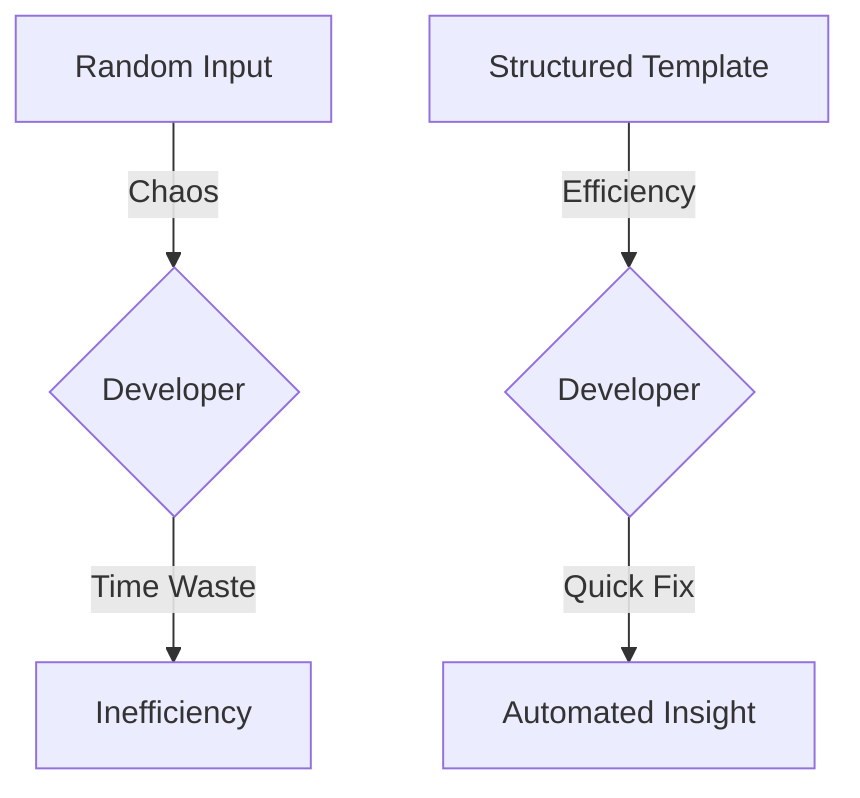

# CH-01: Standardisation: Issue Templates

> **"Kualitas data adalah jaminan kualitas hasil kerja."**

---

## 🔗 1. Source Link
- [GitHub Docs: About Issue & PR Templates](https://docs.github.com/en/communities/using-templates-to-encourage-useful-issues-and-pull-requests/about-issue-and-pull-request-templates)

---

## 📖 2. Penjelasan (The What & The Why)
**Structure Governance** melalui penggunaan **Template** adalah cara Senior Engineer menjamin bahwa setiap masukan yang masuk memiliki standar kualitas minimal yang sama. Dengan memaksakan struktur (seperti langkah reproduksi bug), kita menghemat waktu pengembang dalam mendiagnosis masalah.

---

## 🏗️ 3. Architecture Concept: The Interface Contract
Bayangkan Issue Template adalah sebuah **Formulir Bank**.
*   Jika Anda hanya menulis di selembar kertas kosong "Saya mau tarik uang", transaksi akan lambat karena teller harus bertanya banyak hal.
*   Jika ada **Formulir Khusus**, Anda dipaksa memberikan Nomor Rekening, Nama, dan Nominal. Transaksi jadi instan. Template adalah **Kontrak Interface** antara Pelapor dan Pengembang.

---

## 📊 4. Visual Graph (Mermaid)
Manfaat Standardisasi:



---

## 🛠️ 5. Under-the-hood Mechanics: Configuration
Internal GitHub mendeteksi template di folder `.github/ISSUE_TEMPLATE/`. Setiap file `.md` atau `.yml` di sana diperlakukan sebagai skema input yang akan ditampilkan saat pengguna menekan tombol "New Issue". Ini adalah fitur integrasi level platform.

---

## 🧪 6. Practical CLI Lab
Membuat draft ide template issue:

```bash
# Struktur dasar Feature Request Template
cat <<EOF > feature_request_mock.md
---
name: Feature Request
about: Usulkan ide baru.
title: "feat: "
---

## 🎯 Objective
Apa masalah yang ingin diselesaikan?

## 🛠️ User Story
Sebagai [...] saya ingin [...] agar [...]
EOF
```

---

## 🤝 7. Team Impact (Social Governance)
Standardisasi mengurangi **Friction** (gesekan) antar departemen. Tim QA (Quality Assurance) bisa memberikan laporan yang langsung bisa dikerjakan oleh tim Dev karena formatnya sudah seragam (Expected Result vs Actual Result).

---

## 🚑 8. The Rescue (Undo Tactics): Missing Data
Jika ada laporan issue yang tidak lengkap walaupun sudah pakai template:
```markdown
# Balas dengan sopan tapi tegas (Senior Protocol)
"Masalah Anda belum memiliki langkah reproduksi yang jelas. Tolong lengkapi form sesuai standar agar kami bisa mereproduksinya secara deterministik."
```
*Tindakan Terbaik: Jangan mulai ngoding sebelum input-nya bersih.*

---
*Buku ini mengikuti standar **GMGS** di level Chapter.*
