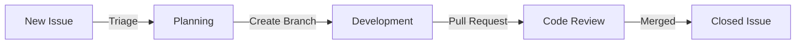

# 📋 SR-03: Issue Management & Governance

> **"Issue adalah unit terkecil dari atom kolaborasi; kelola dengan struktur atau hadapi kekacauan."**

Sub-rak ini membahas sistem pelacakan masalah (issue tracking) di GitHub, mulai dari klasifikasi bug/fitur hingga penggunaan template untuk standardisasi input sebagai Senior Engineer.

---

## 🧭 Navigasi Materi (Buku)

| Code | Buku | Fokus Materi | Link |
| :--- | :--- | :--- | :--- |
| 📖 **BK-01** | **Issue Taxonomy** | Klasifikasi Bug vs Fitur vs Refactor. | **[Buka Buku](./BK-01-Issue-Taxonomy/)** |
| 📖 **BK-02** | **Structure Governance** | Pentingnya Issue Templates (Bug Report & Feature Request). | **[Buka Buku](./BK-02-Structure-Governance/)** |

---

## 🏛️ Arsitektur Konsep: The Source of Truth
Issue di GitHub bertindak sebagai "Pusat Kebenaran" (Source of Truth). Sebelum baris kode diketik, Issue bertugas mengunci **Konteks** (Kenapa kita melakukannya) dan **Constraint** (Apa batasannya). Tanpa Issue, sebuah proyek hanya sekadar kumpulan baris kode tanpa sejarah alasan.

### Visualisasi: Siklus Hidup Issue (Mermaid)


---

## ⚓ Git Mastery Gold Standard (GMGS)

### 1. Source Link
- [GitHub Docs: About Issues](https://docs.github.com/en/issues/tracking-your-work-with-issues/about-issues)
- [GitHub Docs: Issue & PR Templates](https://docs.github.com/en/communities/using-templates-to-encourage-useful-issues-and-pull-requests/about-issue-and-pull-request-templates)

### 2. Architecture: Input Standardisation
Mengapa menggunakan template? Sejatinya, template adalah **"Filter Integritas"**. Senior Engineer menjamin bahwa setiap laporan memiliki metadata minimal (e.g. *Expected vs Actual Result*) agar proses perbaikan menjadi deterministik, bukan tebak-tebakan.

### 3. Practical CLI Lab
Integrasi GitHub CLI (`gh`) untuk manajemen issue:
```bash
# Membuat issue baru via terminal
gh issue create --title "feat: Add dark mode support" --body "Deskripsi detail..."

# List issue yang terbuka
gh issue list

# Menghubungkan PR dengan issue (Keyword: Closes #ID)
# Tuliskan ini di deskripsi commit atau PR
# "feat: implementation of dark mode (Closes #12)"
```

### 4. Team Impact (Social Governance)
- **Labels**: Penggunaan label warna untuk prioritas (High/Low) dan tipe (Bug/Feature).
- **Assignees**: Melacak siapa yang bertanggung jawab atas janji perubahan tersebut.

---
*Materi ini merupakan bagian dari **RAK-05: Ecosystem & Tooling**.*
