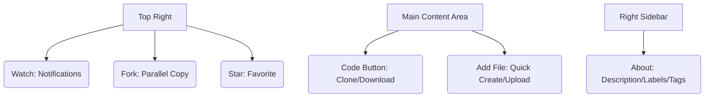

# SC-01: Code Tab Tools (Inventory & Social)

> **"Pusat gravitasi repositori: Lebih dari sekadar daftar file."**

---

## 🔗 1. Source Link
- [GitHub Docs: About Repositories](https://docs.github.com/en/repositories/creating-and-managing-repositories/about-repositories)

---

## 📖 2. Penjelasan (The What & The Why)
Tab **Code** adalah wajah utama proyek Anda. Selain menampilkan file, ia memiliki alat-alat interaksi yang menentukan bagaimana orang lain melihat dan berkontribusi pada kode Anda.

---

## 🏗️ 3. Architecture Concept: The Storefront
Bayangkan tab Code adalah **Etalase Toko**:
*   **Watch**: Adalah "Berlangganan Newsletter" toko tersebut.
*   **Fork**: Adalah "Membuka Cabang Toko Sendiri" dengan barang yang sama.
*   **Star**: Adalah "Memberi Testimoni/Like" pada toko tersebut.

---

## 📊 4. Visual Location (Anatomy)
Letak tombol di layar (Atas & Samping Kanan):



---

## 🛠️ 5. Functional Mechanics (What they do)

| Tool | Fungsi Teknis (Mechanics) | Kapan Digunakan (Senior Level) |
| :--- | :--- | :--- |
| **Watch** | Mengatur intensitas notifikasi email/web. | Saat Anda perlu memantau perubahan krusial di repo tim lain. |
| **Fork** | Membuat repositori duplikat di akun Anda sendiri. | Saat ingin berkontribusi ke open-source tanpa merusak repo aslinya. |
| **Star** | Memberikan apresiasi dan mempermudah pencarian. | Menandai library favorit untuk proyek masa depan. |
| **Code Button** | Menyediakan URL Clone (HTTPS/SSH). | Saat akan memindahkan pekerjaan dari cloud ke mesin lokal. |
| **Add File** | Interface web untuk buat/upload file. | Untuk perubahan dokumentasi kecil tanpa buka terminal. |
| **About (Cog)** | Metadata repositori (Description, Website). | Untuk branding dan SEO agar proyek mudah ditemukan. |

---

## 🧪 6. Practical Action
Cara cepat melakukan klon melalui terminal:
```bash
# Gunakan SSH untuk keamanan lebih tinggi (Senior Grade)
git clone git@github.com:username/repository.git
```

---

## 🤝 7. Team Impact (Social Governance)
Dengan mengisi section **About** dan memberikan **Star**, Anda membangun kredibilitas repositori. **Fork** memungkinkan kolaborasi massal tanpa memberikan akses tulis langsung ke `main`.

---

## 🚑 8. The Rescue (Undo Tactics): Deleting Forks
Jika Anda merasa Fork Anda sudah tidak relevan:
```bash
# Pergi ke Tab Settings di repositori Fork Anda
# Scroll paling bawah ke 'Danger Zone' -> 'Delete this repository'
```

---
*Materi ini merupakan bagian dari **RAK-05 / SR-04 / BK-01 / CH-01**.*
