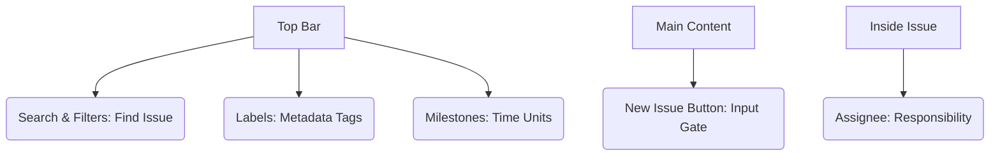

# SC-02: Issue Tab Tools (Planning & Tracking)

> **"Issue adalah unit atomik rencana; kelola dengan detail atau hadapi kekacauan proyek."**

---

## 🔗 1. Source Link
- [GitHub Docs: About Issues](https://docs.github.com/en/issues/tracking-your-work-with-issues/about-issues)
- [Managing Labels](https://docs.github.com/en/issues/using-labels)

---

## 📖 2. Penjelasan (The What & The Why)
Tab **Issues** adalah tempat di mana semua tugas, bug, dan usulan fitur dikelola. Sebagai Senior Engineer, Anda tidak hanya memantau apa yang ada, tetapi mengatur strukturnya agar tim (atau AI) paham prioritas kerja.

---

## 🏗️ 3. Architecture Concept: The To-Do Hub
Bayangkan tab Issues adalah **Papan Kliping Keinginan**:
*   **Labels**: Penanda warna-warni untuk jenis surat (Bug, Fitur).
*   **Milestones**: Amplop besar berisi beberapa surat yang harus selesai dalam satu rilis paket.
*   **Search/Filters**: Cara cepat mencari surat dari ribuan tumpukan.

---

## 📊 4. Visual Location (Anatomy)
Letak tombol di layar (Filter Bar & Samping Kanan):



---

## 🛠️ 5. Functional Mechanics (What they do)

| Tool | Fungsi Teknis (Mechanics) | Kapan Digunakan (Senior Level) |
| :--- | :--- | :--- |
| **New Issue** | Gerbang utama pendaftaran tugas. | Memasukkan bug/fitur ke dalam database sejarah proyek. |
| **Labels** | Tag warna (Category & Priority). | Menstandarisasi tipe pekerjaan (Convention over configuration). |
| **Milestones** | Penanda waktu berjangka. | Mengumpulkan sekumpulan issue untuk rilis versi stabil (e.g. `v1.0.0`). |
| **Search/Filters** | Bahasa kueri (e.g. `is:issue is:open label:bug`). | Mencari bottleneck pekerjaan dengan sangat cepat. |
| **Assignees** | Metadata penanggung jawab. | Memastikan setiap issue memiliki pemilik untuk akuntabilitas. |

---

## 🧪 6. Practical Action
Cara cepat memfilter issue lewat bilah pencarian:
```bash
# Di kotak pencarian GitHub:
is:issue is:open label:bug label:priority:high
```

---

## 🤝 7. Team Impact (Social Governance)
Standardisasi di tab **Issues** mencegah tim bertanya "apa yang harus dikerjakan?". Milestones memberikan rasa "target yang nyata", bukan sekadar list tugas yang tidak berujung.

---

## 🚑 8. The Rescue (Undo Tactics): Reopening Issues
Jika Anda salah menutup issue atau ternyata bug muncul lagi:
```bash
# Pergi ke issue tersebut
# Klik tombol 'Reopen' di bagian bawah (Pesan komentar)
```

---
*Materi ini merupakan bagian dari **RAK-05 / SR-04 / BK-01 / CH-01**.*
