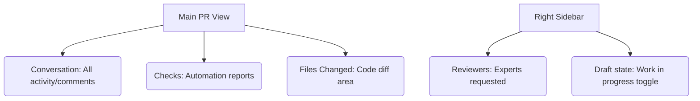

# SC-03: Pull Request Tools (Quality & Integration)

> **"Jembatan menuju penyatuan: Tempat ulasan kualitas dilakukan."**

---

## 🔗 1. Source Link
- [GitHub Docs: About Pull Requests](https://docs.github.com/en/pull-requests/collaborating-with-pull-requests/proposing-changes-to-your-work-with-pull-requests/about-pull-requests)
- [Reviewing Changes](https://docs.github.com/en/pull-requests/collaborating-with-pull-requests/reviewing-changes-in-pull-requests/about-pull-request-reviews)

---

## 📖 2. Penjelasan (The What & The Why)
Tab **Pull Requests (PR)** adalah pintu gerbang terakhir sebelum kode masuk ke rumah utama (`main`). Sebagai Senior Engineer, di sini Anda memastikan bahwa kode tidak mengandung bug, efisien, dan mematuhi standar desain.

---

## 🏗️ 3. Architecture Concept: The Border Control
Bayangkan tab PR adalah **Pos Pemeriksaan Perbatasan**:
*   **Draft PR**: Mengatakan "Saya sedang di jalan, tapi ingin menunjukkan bawaan saya sementara."
*   **Reviewers**: Adalah petugas bea cukai yang mengecek isi koper (kode) Anda.
*   **Checks**: Adalah anjing pelacak (Robot Action) yang mengendus kesalahan teknis otomatis.

---

## 📊 4. Visual Location (Anatomy)
Letak tombol di layar (Conversation, Files, Samping Kanan):



---

## 🛠️ 5. Functional Mechanics (What they do)

| Tool | Fungsi Teknis (Mechanics) | Kapan Digunakan (Senior Level) |
| :--- | :--- | :--- |
| **Draft PR** | Status "non-mergable" (Belum siap gabung). | Saat ingin kolaborasi awal tanpa mengaktifkan seluruh robot testing. |
| **Reviewers** | Delegasi tanggung jawab tinjauan. | Meminta senior atau rekan tim untuk memvalidasi logika kompleks. |
| **File Changed** | Perbandingan visual baris demi baris. | Melakukan analisis dampak perubahan (Impact analysis). |
| **Checks (Actions)** | Dashboard hasil eksekusi robot. | Menunda merge hingga robot menyatakan kode "passed" (aman). |
| **Conversation** | Log sejarah diskusi dan perubahan. | Menyimpan memori keputusan teknis untuk masa depan (Audit trail). |

---

## 🧪 6. Practical Action
Cara cepat meninjau perbedaan kode di tab "Files Changed":
1.  Klik **Files Changed**.
2.  Gunakan navigasi pohon file di sisi kiri.
3.  Berikan komentar langsung pada nomor baris untuk diskusi yang akurat.

---

## 🤝 7. Team Impact (Social Governance)
Standardisasi di tab **Pull Requests** menjamin akuntabilitas. Tidak ada satu orang pun yang bisa "meloloskan" kode secara sembunyi-sembunyi tanpa pemeriksaan, menjaga kualitas produk secara kolektif.

---

## 🚑 8. The Rescue (Undo Tactics): Closing PRs
Jika Anda berubah pikiran dan fitur tersebut tidak ingin digabungkan:
```bash
# Pergi ke bagian bawah PR
# Klik 'Close Pull Request' (Jangan di-merge)
# Jika sudah di-merge? Gunakan git revert di terminal (lihat SC-01).
```

---
*Materi ini merupakan bagian dari **RAK-05 / SR-04 / BK-01 / CH-01**.*
