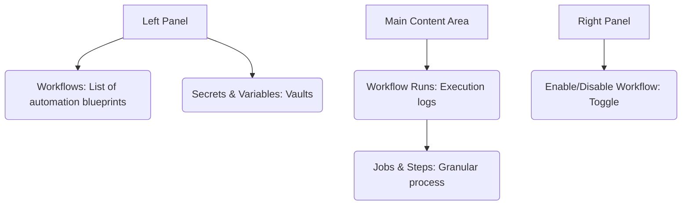

# SC-01: Actions Tools (The Robot Factory)

> **"Robot adalah asisten Anda yang tidak pernah tidur: Kuasai alur kerjanya."**

---

## 🔗 1. Source Link
- [GitHub Actions Documentation](https://docs.github.com/en/actions)
- [Workflow Syntax for GitHub Actions](https://docs.github.com/en/actions/using-workflows/workflow-syntax-for-github-actions)

---

## 📖 2. Penjelasan (The What & The Why)
Tab **Actions** adalah rumah bagi otomasi (CI/CD). Di sini Anda bisa membuat sekumpulan skrip (Workflows) yang berjalan secara otomatis setiap kali Anda melakukan perubahan kode. Ini adalah kunci kecepatan Senior Engineer agar tidak melakukan pengulangan manual yang membosankan.

---

## 🏗️ 3. Architecture Concept: The Assembly Line
Bayangkan tab Actions adalah **Lini Perakitan Mobil**:
*   **Workflows**: Adalah Buku Panduan merakit mobil (Skrip `.yml`).
*   **Runs**: Adalah Unit Mobil yang sedang dirakit di pabrik.
*   **Secrets**: Adalah Kode Brankas untuk mengambil bensin (API Keys).
*   **Variables**: Adalah Kode Keperluan pabrik yang tidak rahasia.

---

## 📊 4. Visual Location (Anatomy)
Letak tombol di layar (Panel Kiri & Atas):



---

## 🛠️ 5. Functional Mechanics (What they do)

| Tool | Fungsi Teknis (Mechanics) | Kapan Digunakan (Senior Level) |
| :--- | :--- | :--- |
| **Workflows** | Definisi kejadian (Triggers) dan langkah. | Saat Anda ingin mendefinisikan "Kapan robot harus mulai bekerja". |
| **Runs** | Sejarah eksekusi per kejadian. | Saat audit kenapa proses testing atau deployment gagal. |
| **Secrets** | Brankas enkripsi level repositori. | Menyimpan data sensitif (Token, Password) agar tidak bocor di log. |
| **Variables** | Data konfigurasi non-sensitif. | Menyimpan URL Staging atau Versi Node.js yang digunakan tim. |
| **Job Logs** | Panel detil baris per baris robot. | Mendiagnosis eror tepat di baris perintah mana robot terhenti. |

---

## 🧪 6. Practical Action
Cara cepat melihat hasil eksekusi robot:
1.  Klik tab **Actions**.
2.  Pilih nama **Workflow** di sisi kiri.
3.  Klik pada **Run** teratas untuk melihat detail status (Success/Failure).

---

## 🤝 7. Team Impact (Social Governance)
Menggunakan **Actions** menjamin kualitas kode seragam bagi seluruh tim. Jika satu orang merusak kode, robot akan segera melaporkannya ke tab PR, sehingga kesalahan tidak menjalar ke orang lain.

---

## 🚑 8. The Rescue (Undo Tactics): Re-running Failed Jobs
Jika robot gagal karena masalah jaringan (bukan kesalahan kode):
```bash
# Pergi ke halaman Run tersebut
# Klik tombol 'Re-run failed jobs' di bagian atas kanan
```
*Tindakan Terbaik: Jangan paksa merge jika robot masih bertanda silang merah.*

---
*Materi ini merupakan bagian dari **RAK-05 / SR-04 / BK-01 / CH-02**.*
