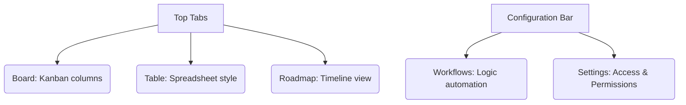

# SC-02: Project Tools (The Strategy Center)

> **"Radar proyek Anda: Jangan biarkan tugas hilang dalam tumpukan."**

---

## 🔗 1. Source Link
- [GitHub Docs: About Projects](https://docs.github.com/en/issues/planning-and-tracking-with-projects/learning-about-projects/about-projects)
- [Working with Views](https://docs.github.com/en/issues/planning-and-tracking-with-projects/customizing-views-in-your-project)

---

## 📖 2. Penjelasan (The What & The Why)
Tab **Projects** adalah alat navigasi tingkat tinggi (Management). Di sini Anda bisa mengelompokkan Issue dari satu atau banyak repositori sekaligus ke dalam sebuah papan visual (Kanban). Ini adalah cara Senior Engineer melihat gambaran besar (The Big Picture).

---

## 🏗️ 3. Architecture Concept: The Control Tower
Bayangkan tab Projects adalah **Menara Pengawal Bandara**:
*   **Board View**: Adalah Radar yang menunjukkan posisi pesawat (Issue) di darat/udara.
*   **Table View**: Adalah Daftar log manifes penerbangan (Data detail).
*   **Automation**: Adalah Sistem autopilot yang mengarahkan pesawat ke gerbang (Status Done) saat mendarat.

---

## 📊 4. Visual Location (Anatomy)
Letak tombol di layar (Atas & Panel Kanan):



---

## 🛠️ 5. Functional Mechanics (What they do)

| Tool | Fungsi Teknis (Mechanics) | Kapan Digunakan (Senior Level) |
| :--- | :--- | :--- |
| **Board View** | Visualisasi status (To Do, In Progress, Done). | Saat butuh gambaran cepat progres harian. |
| **Table View** | Pengeditan data massal (Bulk editing). | Saat ingin mengatur prioritas atau estimasi banyak isu sekaligus. |
| **Roadmap** | Tampilan garis waktu (Gantt Chart). | Saat presentasi ke pemangku kepentingan mengenai target jangka panjang. |
| **Workflows** | Otomasi perpindahan kartu. | Menghemat waktu pindah kartu manual saat Issue/PR berubah status. |
| **Custom Fields** | Penambahan metadata (e.g., Difficulty, Sprint). | Saat butuh filter data yang tidak ada di standar Issue. |

---

## 🧪 6. Practical Action
Cara cepat memindahkan kartu:
1.  Klik dan tahan kartu Issue.
2.  Tarik (drag) ke kolom status yang sesuai.
3.  Cek apakah Action otomatis berjalan di tab PR.

---

## 🤝 7. Team Impact (Social Governance)
Menggunakan **Projects** memberikan transparansi penuh bagi seluruh departemen. Tidak ada "tugas siluman" (hidden tasks) yang tidak diketahui rekan satu tim, meminimalisir risiko keterlambatan proyek.

---

## 🚑 8. The Rescue (Undo Tactics): Archiving Cards
Jika sebuah kartu di Project sudah selesai dan menyemak (cluttered):
```bash
# Pergi ke kartu tersebut di Project View
# Pilih menu (Tiga titik) -> Archive
# Kartu ini tidak hilang, tapi disembunyikan agar tampilan bersih.
```

---
*Materi ini merupakan bagian dari **RAK-05 / SR-04 / BK-01 / CH-02**.*
