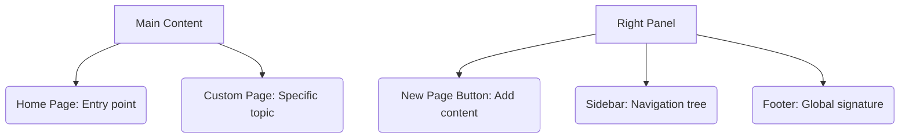

# SC-03: Wiki Tools (The Support Center)

> **"Pusat pengetahuan jangka panjang: Jangan biarkan dokumentasi terserak."**

---

## 🔗 1. Source Link
- [GitHub Docs: About Wikis](https://docs.github.com/en/communities/documenting-your-project-with-wikis/about-wikis)
- [Managing Wiki Content](https://docs.github.com/en/communities/documenting-your-project-with-wikis/adding-or-editing-wiki-pages)

---

## 📖 2. Penjelasan (The What & The Why)
Tab **Wiki** adalah rumah bagi dokumentasi statis dan panduan panjang (Documentation). Berbeda dengan README yang bersifat ringkasan, Wiki adalah tempat Anda menulis detail teknis mendalam yang mungkin mencapai belasan halaman tanpa mengotori folder kode utama.

---

## 🏗️ 3. Architecture Concept: The Reference Library
Bayangkan tab Wiki adalah **Perpustakaan Referensi**:
*   **Pages**: Adalah Buku-buku di dalam rak.
*   **Sidebar**: Adalah Denah lokasi buku di perpustakaan.
*   **Home**: Adalah Lobi resepsionis tempat Anda mulai mencari informasi.

---

## 📊 4. Visual Location (Anatomy)
Letak tombol di layar (Panel Kanan & Atas):



---

## 🛠️ 5. Functional Mechanics (What they do)

| Tool | Fungsi Teknis (Mechanics) | Kapan Digunakan (Senior Level) |
| :--- | :--- | :--- |
| **New Page** | Membuat file `.md` baru dalam repositori Wiki. | Saat ada topik baru yang butuh penjelasan detail (e.g. "Cara Install Database"). |
| **Custom Sidebar** | Mengatur navigasi daftar isi manual. | Mengatur hierarki pengetahuan agar mudah dicari oleh tim baru. |
| **History** | Rekaman sejarah perubahan halaman Wiki. | Mengetahui siapa yang mengupdate instruksi teknis jika ada kesalahan. |
| **Footer** | Bagian bawah statis di setiap halaman. | Menaruh link penting atau kontak bantuan (Support) di semua halaman. |

---

## 🧪 6. Practical Action
Cara cepat membuat navigasi sidebar kustom:
1.  Klik tombol **Edit Sidebar** di sisi kanan.
2.  Tulis daftar isi menggunakan format Markdown list: `[Nama Halaman](URL-Halaman)`.
3.  Simpan untuk menerapkan navigasi di seluruh halaman Wiki.

---

## 🤝 7. Team Impact (Social Governance)
Memiliki **Wiki** yang teratur mengurangi waktu *onboarding* anggota tim baru (Onboarding efficiency). Mereka bisa belajar mandiri tanpa harus terus bertanya kepada Senior Engineer tentang hal-hal teknis yang bersifat repetitif.

---

## 🚑 8. The Rescue (Undo Tactics): Reverting Wiki Pages
Jika seseorang merusak instruksi di Wiki:
```bash
# Pergi ke halaman Wiki tersebut
# Klik tab 'History' di bagian atas kanan
# Pilih versi sebelumnya yang benar -> Klik 'Revert'
```

---
*Materi ini merupakan bagian dari **RAK-05 / SR-04 / BK-01 / CH-02**.*
