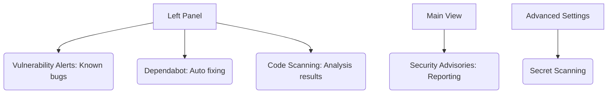

# SC-01: Security Tools (The Shield Hub)

> **"Keamanan bukan fitur, melainkan fondasi: Lindungi kode Anda dari ancaman."**

---

## 🔗 1. Source Link
- [GitHub Security Documentation](https://docs.github.com/en/code-security)
- [How Dependabot Works](https://docs.github.com/en/code-security/dependabot/about-dependabot-security-updates)

---

## 📖 2. Penjelasan (The What & The Why)
Tab **Security** adalah perisai repositori Anda. Sebagai Senior Engineer, tugas Anda adalah memastikan kode tidak memiliki kerentanan (vulnerabilities) yang bisa dieksploitasi oleh hacker atau merugikan pengguna akhir.

---

## 🏗️ 3. Architecture Concept: The Security Guard
Bayangkan tab Security adalah **Sistem Alarm Gedung**:
*   **Dependabot**: Adalah Petugas yang mengecek setiap paket barang yang masuk (Library) apakah beracun atau tidak.
*   **Code Scanning**: Adalah Sinar-X yang mengecek struktur bangunan (Kode) apakah ada yang rapuh.
*   **Secret Scanning**: Adalah Sensor Panas yang berbunyi jika ada yang membawa bahan peledak (Password/Token API) masuk ke gedung.

---

## 📊 4. Visual Location (Anatomy)
Letak tombol di layar (Panel Kiri & Atas):



---

## 🛠️ 5. Functional Mechanics (What they do)

| Tool | Fungsi Teknis (Mechanics) | Kapan Digunakan (Senior Level) |
| :--- | :--- | :--- |
| **Dependabot** | Pemindaian `.json`/`.yml` ketergantungan paket. | Saat ada update keamanan di library yang Anda gunakan. |
| **Code Scanning** | Analisis statis (SAST) menggunakan CodeQL. | Sebelum merilis produk besar ke lingkungan produksi (Production). |
| **Secret Scanning** | Pemindaian pola string API Key / Password. | Menjaga agar kunci akses infrastruktur tidak terekspos ke publik. |
| **Security Advisories** | Forum pribadi untuk diskusi celah keamanan. | Saat menemukan bug kritis dan ingin memperbaikinya sebelum dipublikasikan. |

---

## 🧪 6. Practical Action
Cara cepat mengaktifkan Dependabot:
1.  Klik tab **Security**.
2.  Pilih **Dependabot alerts** -> Klik **Enable**.
3.  Robot akan mulai memantau library Anda dan membuka PR otomatis jika ada masalah.

---

## 🤝 7. Team Impact (Social Governance)
Memiliki tab **Security** yang bersih ("Green State") memberikan rasa aman bagi kontributor dan pengguna. Ini membangun reputasi "Professional Grade Project" yang bisa dipercaya oleh perusahaan besar.

---

## 🚑 8. The Rescue (Undo Tactics): Revoking Compromised Keys
Jika **Secret Scanning** mendeteksi ada Token API yang bocor:
```bash
# JANGAN HANYA HAPUS KODE NYA
# Segera pergi ke dashboard Service tersebut (Misal: AWS atau Stripe)
# Klik 'Revoke' atau 'Regenerate' Token segera.
# Baru kemudian hapus kode bocor tersebut dari sejarah Git (Force push).
```

---
*Materi ini merupakan bagian dari **RAK-05 / SR-04 / BK-01 / CH-03**.*
