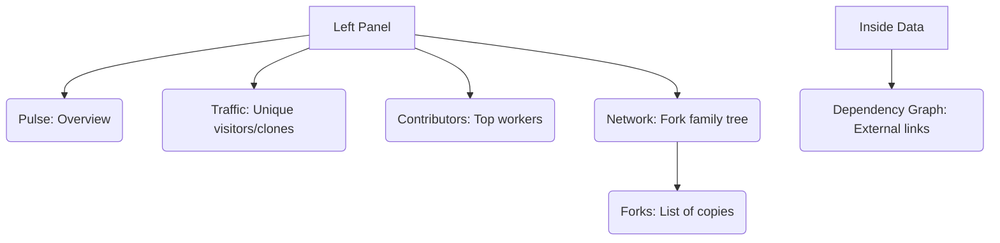

# SC-02: Insight Analytics (The Audit Hub)

> **"Data adalah cermin kejujuran: Ketahui siapa, kapan, dan bagaimana proyek Anda berkembang."**

---

## 🔗 1. Source Link
- [GitHub Docs: About Repository Insights](https://docs.github.com/en/repositories/viewing-activity-and-data-for-your-repository/about-repository-insights)
- [Viewing Traffic Data](https://docs.github.com/en/repositories/viewing-activity-and-data-for-your-repository/viewing-traffic-to-a-repository)

---

## 📖 2. Penjelasan (The What & The Why)
Tab **Insights** adalah pusat data dan refleksi diri proyek Anda. Di sini Anda bisa melihat statistik produktivitas (siapa yang paling banyak commit), popularitas (traffic pengunjung), dan sejarah percabangan (Network). Senior Engineer menggunakan data ini untuk mendeteksi _bottleneck_ pengerjaan.

---

## 🏗️ 3. Architecture Concept: The Health Monitor
Bayangkan tab Insights adalah **Dashboard Kesehatan Pasien**:
*   **Pulse**: Adalah Denyut Nadi (Apa yang terjadi dalam 7 hari terakhir?).
*   **Traffic**: Adalah Jumlah Pengunjung ke rumah sakit (Populer atau tidak?).
*   **Contributors**: Adalah Daftar Dokter yang menangani pasien (Siapa yang paling rajin?).
*   **Network**: Adalah Silsilah Keluarga (Keturunan Fork dari proyek ini).

---

## 📊 4. Visual Location (Anatomy)
Letak tombol di layar (Panel Kiri & Daftar Grafik):

---

## 🛠️ 5. Functional Mechanics (What they do)

| Tool | Fungsi Teknis (Mechanics) | Kapan Digunakan (Senior Level) |
| :--- | :--- | :--- |
| **Pulse** | Ringkasan 24 jam s/d 1 bulan (Issues/PR/Commits). | Saat rapat mingguan untuk melaporkan progres singkat. |
| **Traffic** | Grafik pengunjung unik dan jumlah klon. | Menganalisis apakah kampanye promosi rilis Anda berhasil. |
| **Contributors** | Analisis penulisan baris kode (Additions/Deletions). | Melihat ketergantungan proyek pada satu orang pengembang. |
| **Network Graph** | Visualisasi sejarah Branch & Merge lintas Fork. | Mencari tahu siapa yang membuat modifikasi menarik di repositori cabang (Fork). |
| **Dependency Graph** | Katalog semua library yang Anda pakai. | Audit total ekosistem yang menopang aplikasi Anda. |

---

## 🧪 6. Practical Action
Cara cepat mengecek popularitas proyek:
1.  Klik tab **Insights**.
2.  Pilih **Traffic** di sisi kiri.
3.  Lihat data **Unique Visitors** (Pengunjung Unik) untuk mengetahui jangkauan nyata proyek Anda.

---

## 🤝 7. Team Impact (Social Governance)
Data **Insights** mencegah kecemburuan sosial dalam tim karena kontribusi terlihat secara transparan. Milestones dan grafik kontributor memberikan motivasi visual bagi tim untuk terus bergerak maju sesuai target.

---

## 🚑 8. The Rescue (Undo Tactics): Identifying Bottlenecks
Jika proyek terasa lambat:
1.  Buka tab **Insights** -> **Contributors**.
2.  Cek apakah ada "One-Man-Army" (Semua kerjaan menumpuk di satu orang).
3.  **Solusi**: Distribusikan beban kerja ke orang lain melalui Assignees di Tab Issues.

---
*Materi ini merupakan bagian dari **RAK-05 / SR-04 / BK-01 / CH-03**.*
