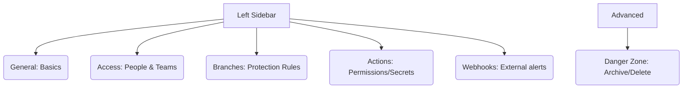

# SC-03: Settings & Config (The Law Hub)

> **"Aturan main adalah benteng pertahanan: Konfigurasi yang tepat adalah kunci keamanan."**

---

## 🔗 1. Source Link
- [GitHub Docs: Repository settings](https://docs.github.com/en/repositories/configuring-branches-and-merges-in-your-repository/about-protected-branches)
- [Managing Collaborators Access](https://docs.github.com/en/repositories/managing-your-repositorys-settings-and-features/managing-repository-settings/managing-teams-and-people-with-access-to-your-repository)

---

## 📖 2. Penjelasan (The What & The Why)
Tab **Settings** adalah pusat kendali (Governance). Di sinilah Anda menetapkan "hukum" yang berlaku di repositori Anda. Senior Engineer menggunakan tab ini bukan hanya untuk mengganti nama, tapi untuk membatasi siapa yang boleh mengubah kode (`main`) dan mengintegrasikan layanan luar (Webhooks).

---

## 🏗️ 3. Architecture Concept: The Constitution
Bayangkan tab Settings adalah **UUD / Konstitusi Negara**:
*   **General**: Adalah Nama dan Bendera negara.
*   **Access**: Adalah Siapa yang boleh masuk menjadi warga negara (Collaborators).
*   **Branches**: Adalah Polisi dan Jaksa (Penegak hukum merge).
*   **Webhooks**: Adalah Kedutaan Besar yang memberi tahu dunia luar (Slacks/Discord) jika ada kejadian.

---

## 📊 4. Visual Location (Anatomy)
Letak tombol di layar (Panel Navigasi Kiri):



---

## 🛠️ 5. Functional Mechanics (What they do)

| Tool | Fungsi Teknis (Mechanics) | Kapan Digunakan (Senior Level) |
| :--- | :--- | :--- |
| **General** | Identitas (Rename, Visibility). | Mengganti nama proyek atau memindahkannya ke publik/privat. |
| **Access Control** | Pengaturan RBAC (Role-Based Access Control). | Mendelegasikan akses tulis/baca ke anggota tim baru. |
| **Branch Protection** | Syarat penggabungan (e.g. Minimal 1 Review). | Menjaga agar kode di `main` tidak bisa didelete atau di-push sembarangan. |
| **Actions Config** | Izin eksekusi robot. | Membatasi robot agar tidak bisa memboroskan kuota menit Action. |
| **Webhooks** | Pengirim notifikasi POST (JSON) ke URL luar. | Menghubungkan GitHub ke Slack atau Discord tim. |

---

## 🧪 6. Practical Action
Cara cepat memproteksi branch utama:
1.  Klik tab **Settings** -> **Branches**.
2.  Klik **Add branch protection rule**.
3.  Tulis `main` -> Centang **Require a pull request before merging**.
4.  Centang **Require approvals** (Min 1).

---

## 🤝 7. Team Impact (Social Governance)
Menggunakan **Branch Protection** menghilangkan ketakutan "bagaimana jika saya salah hapus kode?". Ini menciptakan lingkungan kerja yang aman bagi pengembang pemula sekaligus menjaga standar kualitas bagi pengembang senior.

---

## 🚑 8. The Rescue (Undo Tactics): Unprotecting Branches
Jika dalam kondisi darurat (Hotfix sangat kritis) Anda perlu memintas aturan:
```bash
# Pergi ke Tab Settings -> Branches
# Edit Rule 'main'
# Matikan sementara 'Require a pull request before merging'
# Lakukan push, lalu NYALAKAN KEMBALI SEGERA.
```
*Tindakan Terbaik: Jangan matikan aturan kecuali Anda satu-satunya orang yang tahu risiko nya.*

---
*Materi ini merupakan bagian dari **RAK-05 / SR-04 / BK-01 / CH-03**.*
