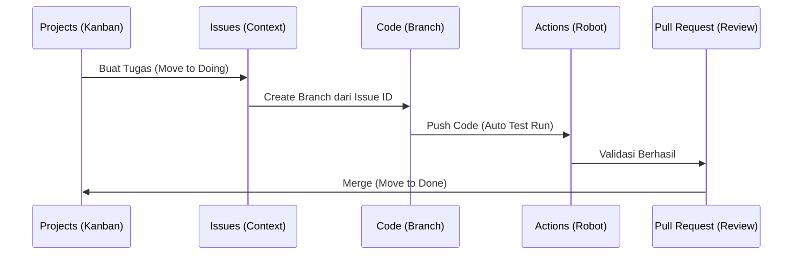

# CH-01: The Efficiency Flow (The Golden Thread)

> **"Kunci kecepatan bukanlah pada mengetik lebih cepat, tapi pada alur yang tidak terputus."**

---

## 🔗 1. Source Link
- [GitHub Flow (Official Guide)](https://docs.github.com/en/get-started/quickstart/github-flow)
- [How to Optimize GitHub Workflow](https://github.blog/2021-04-12-how-to-optimize-your-github-workflow/)

---

## 📖 2. Penjelasan (The What & The Why)
**The Efficiency Flow** adalah strategi sinkronisasi lintas Tab di GitHub. Banyak pengamat bingung karena mereka memperlakukan setiap tab (Issues, Code, PR) sebagai entitas terpisah. Di level Senior, kita menghubungkan semuanya menjadi satu **Benang Merah** (The Golden Thread).

---

## 🏗️ 3. Architecture Concept: The Seamless Linkage
Bayangkan Anda adalah seorang **Operator Kereta Api**:
1.  **Issues**: Adalah **Jadwal Keberangkatan**.
2.  **Projects**: Adalah **Sistem Kontrol Rel**.
3.  **Code (Branch)**: Adalah **Gerbong Kereta** yang membawa barang.
4.  **Actions**: Adalah **Pengecekan Keamanan** sebelum masuk stasiun.
5.  **Tags**: Adalah **Stempel Selesai** pengiriman.

---

## 📊 4. Visual Graph (Mermaid)
Alur Kerja Efisien (The Golden Loop):



---

## 🛠️ 5. Under-the-hood Mechanics: The Automation Keywords
Kunci dari sinkronisasi ini adalah **Keyword Otomatis**. Saat Anda menulis deskripsi di PR: `Closes #123`, GitHub akan secara otomatis menutup _Issue_ nomor 123 dan memindahkan kartu di _Project_ saat PR tersebut di-merge. Ini adalah "Magic" yang menghemat berpuluh-puluh klik manual.

---

## 🧪 6. Practical CLI Lab
Alur kerja tercepat dari terminal:
```bash
# 1. Pilih tugas dari Issue list
gh issue list

# 2. Buat branch langsung (Ganti ID sesuai issue)
gh issue develop 1 --name "feat-dashboard"

# 3. Setelah coding, buka PR dan hubungkan ke Project
gh pr create --title "feat: dashboard" --body "Closes #1" -p "My Roadmap"
```

---

## 🤝 7. Team Impact (Social Governance)
Dengan alur yang terhubung, manajer proyek tidak perlu lagi menanyakan "Sampai mana progresnya?". Cukup lihat di tab **Projects** atau **Insights**, semua data terkini tersedia secara otomatis.

---

## 🚑 8. The Rescue (Undo Tactics): Breaking the Loop
Jika alur terhenti karena kegagalan di Actions:
1.  Jangan pernah abaikan laporan kesalahan di tab Actions.
2.  Gunakan tab **Checks** di Pull Request untuk mendiagnosis baris kode mana yang menyebabkan kegagalan sebelum mencoba me-merge secara paksa.

---
*Buku ini mengikuti standar **GMGS** di level Chapter.*
