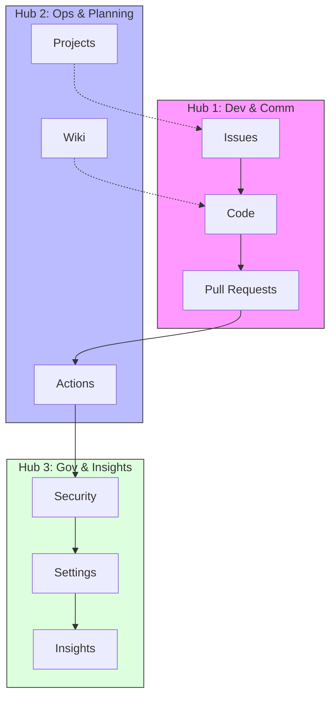

# 🏛️ SR-04: Repository Anatomy & Optimization

> **"Kenali senjatamu, kuasai medannya, dan menangkan proyekmu."**

Sub-rak ini didedikasikan untuk membedah seluruh labirin antarmuka GitHub (9 Tabs) hingga ke level **atomik (Section SC)**. Materi ini dirancang agar Anda memahami setiap tombol dan alat untuk menunjang kecepatan eksekusi proyek.

---

## 🧭 Navigasi Sektor (Buku)

| Code | Buku | Fokus Materi | Link |
| :--- | :--- | :--- | :--- |
| 📖 **BK-01** | **Interface The Tabs** | Bedah atomik 9 Tab di bawah 3 Hub Sektor. | **[Buka Buku](./BK-01-Interface-The-Tabs/)** |
| 📖 **BK-02** | **Optimization Playbook** | Strategi alur kerja (workflow) lintas tab. | **[Buka Buku](./BK-02-Optimization-Playbook/)** |

---

## 🏛️ Arsitektur Konsep: The Command Center (3-Hubs)

Untuk memudahkan peta mental Anda, ke-9 tab GitHub dibagi menjadi **3 Hub Utama**:

1.  🛡️ **Development & Communication (CH-01)**: `Code`, `Issues`, `Pull Requests`.
2.  🤖 **Operations & Planning (CH-02)**: `Actions`, `Projects`, `Wiki`.
3.  ⚖️ **Governance & Insights (CH-03)**: `Security`, `Insights`, `Settings`.

### Visualisasi: Konektivitas Atomik (Mermaid)

---
*Materi ini merupakan bagian dari **RAK-05: Ecosystem & Tooling**.*
