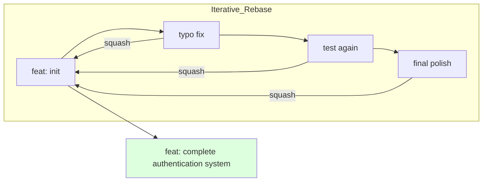

# CH-01: Squash, Fixup, & Drop (Intermediate Rebase Mastery)

> **"Jangan biarkan sejarah Anda kotor oleh commit 'typo' atau 'test'. Pahatlah sejarah yang bercerita."**

## 🔗 1. Source Link
- [Interactive Rebasing (Official)](https://git-scm.com/book/en/v2/Git-Tools-Rewriting-History#_interactive_rebasing)

## 📖 2. Penjelasan (The What & The Why)
**Interactive Rebase (`git rebase -i`)** adalah alat pembedah sejarah Git yang memungkinkan Anda mengubah, menggabungkan, atau menghapus commit di masa lalu sebelum mereka dipublikasikan (Push). Ini adalah kunci untuk menjaga agar Pull Request Anda bersih, kohesif, dan mudah diulas oleh rekan tim.

## 🏗️ 3. Architecture Concept: The Time Sculptor
Bayangkan Anda adalah seorang **Pematung Waktu**. Saat bekerja, Anda membuat banyak potongan kasar dan sampah di sekitar patung Anda (commit kecil/test). Sebelum memamerkan patung tersebut di galeri (Push to Main), Anda memahat dan membersihkan sampah-sampah tersebut, sehingga yang tersisa hanyalah hasil karya yang halus dan bermakna.

## 📊 4. Visual Graph (Mermaid)
Proses Penyatuan Commit (Squash):



## 🛠️ 5. Under-the-hood Mechanics
Saat menjalankan rebase interaktif, Git membuat direktori sementara di `.git/rebase-merge/` yang berisi daftar instruksi (*todo list*). Git kemudian secara otomatis melakukan "detasemen" HEAD dan memutar ulang commit satu per satu sesuai instruksi Anda. Jika Anda memilih `squash`, Git menggabungkan pesan dan konten commit tersebut ke commit sebelumnya dalam satu objek commit baru.

## 🧪 6. Practical CLI Lab
Merapikan tiga commit terakhir:

```bash
# Memulai rebase interaktif untuk 3 commit terakhir
git rebase -i HEAD~3

# Di dalam editor teks yang muncul:
# Ubah 'pick' menjadi 's' (squash) untuk commit yang ingin digabung.
# Ubah 'pick' menjadi 'f' (fixup) jika ingin menggabung tanpa menyimpan pesan commit-nya.
```

## 🤝 7. Team Impact (Social Governance)
Merapikan sejarah melalui rebase adalah bentuk **Empati terhadap Reviewer**. Membaca satu commit besar yang terorganisir jauh lebih menyenangkan daripada membaca 10 commit kecil yang isinya hanya perbaikan typo berulang kali. Ini mempercepat proses *Code Review*.

## 🚑 8. The Rescue (Undo Tactics): Aborting the Sculpting
Jika Anda merasa kacau saat proses rebase (misal: muncul banyak konflik yang tidak terduga):
```bash
# Membatalkan seluruh proses rebase dan kembali ke kondisi asli
git rebase --abort
```
*Ingat: Jangan pernah melakukan rebase pada commit yang sudah di-push ke cabang publik milik bersama!*
