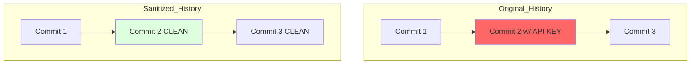

# CH-01: Removing Sensitive Data (The Deep Purge)

> **"Sekali Anda melakukan push pada password, ia akan selamanya ada di sejarah... kecuali Anda melakukan pembersihan total."**

## 🔗 1. Source Link
- [Removing sensitive data from a repository (GitHub Docs)](https://docs.github.com/en/authentication/keeping-your-account-and-data-secure/removing-sensitive-data-from-a-repository)
- [git-filter-repo (Tool Recommendation)](https://github.com/newren/git-filter-repo)

## 📖 2. Penjelasan (The What & The Why)
Karena Git bersifat imutabel, menghapus file rahasia (seperti `.env` atau kunci API) dengan commit baru tidak akan menghilangkannya dari sejarah; file tersebut masih bisa diakses dengan berpindah ke commit lama. **History Sanitization** adalah proses menulis ulang *seluruh* sejarah repositori untuk menghapus jejak file tersebut secara permanen dari setiap titik di dalam DAG.

## 🏗️ 3. Architecture Concept: The Deep Purge
Bayangkan sebuah **Buku Sejarah**. Seseorang menulis rahasia negara di halaman 50. Jika Anda hanya merobek halaman 50, orang masih bisa melihat bekas robekannya atau mencari salinannya. *The Deep Purge* adalah proses mencetak ulang "seluruh buku" dari awal tanpa menyertakan kalimat rahasia tersebut di halaman mana pun.

## 📊 4. Visual Graph (Mermaid)
Transformasi Graf Setelah Pembersihan:



## 🛠️ 5. Under-the-hood Mechanics
Alat modern seperti `git-filter-repo` (pengganti `git filter-branch` yang lambat) bekerja dengan memanipulasi *fast-import* stream dari Git. Ia membedah setiap objek commit, menghapus referensi ke objek blob yang dilarang, dan menghitung ulang seluruh Hash SHA-1 ke depan. Akibatnya, semua commit setelah titik pembersihan akan memiliki ID (Hash) yang baru.

## 🧪 6. Practical CLI Lab
Menghapus file `.env` dari seluruh sejarah:

```bash
# Menggunakan git-filter-repo (Wajib install terlebih dahulu)
git filter-repo --path .env --invert-paths

# Setelah selesai, Anda harus melakukan Push Paksa (Force Push)
# git push origin main --force --all
```

## 🤝 7. Team Impact (Social Governance)
Pembersihan sejarah adalah **Operasi Destruktif Massal**. Seluruh tim akan kehilangan sinkronisasi dengan server karena sejarah telah berubah. Operasi ini harus dikomunikasikan dengan jelas, dan semua pengembang wajib melakukan *fresh clone* setelah pembersihan selesai.

## 🚑 8. The Rescue (Undo Tactics): The Mirror Clone
Jika proses pembersihan salah menghapus file penting:
1. Segera pulihkan dari rekan tim yang belum melakukan `pull`.
2. Atau gunakan backup repository (Mirror Clone) yang dibuat sebelum operasi pembersihan dimulai.
*Selalu buat `git clone --mirror` sebagai cadangan sebelum melakukan bedah sejarah.*
