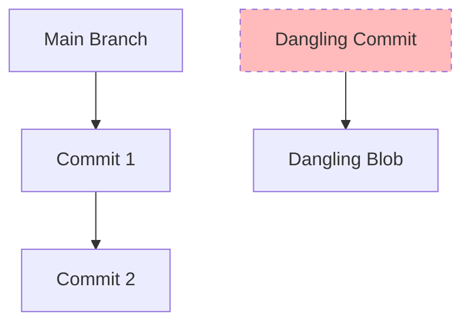

# CH-01: Database Integrity Check (Surgical Repair via Fsck)

> **"Verifikasi adalah satu-satunya pelindung integritas dalam database terdistribusi."**

## 🔗 1. Source Link
- [Git fsck Documentation](https://git-scm.com/docs/git-fsck)

## 📖 2. Penjelasan (The What & The Why)
**Git Fsck (File System Check)** adalah alat diagnostik tingkat rendah (Plumbing) yang melakukan audit menyeluruh terhadap pangkalan data objek Git. Ia memeriksa apakah setiap Hash SHA-1 masih valid, apakah ada objek yang korup, dan apakah ada objek yang "terputus" dari graf utama (objek yang tidak memiliki rujukan cabang atau tag). Ini adalah pemeriksaan kesehatan mutlak untuk repositori.

## 🏗️ 3. Architecture Concept: The Deep Scan
Bayangkan sebuah **Scan Medis (MRI)**. Dokter tidak hanya melihat permukaan kulit Anda (git log), tapi juga memindai jaringan saraf dan tulang (Object Database). Fsck mencari "patah tulang" (broken links) atau "infeksi" (corrupt objects) yang bisa merusak sistem di masa depan.

## 📊 4. Visual Graph (Mermaid)
Mendeteksi Objek Terputus (**Dangling Objects**):



## 🛠️ 5. Under-the-hood Mechanics
Fsck menelusuri setiap objek di dalam folder `.git/objects`, menghitung ulang Hash SHA-1 dari konten fisiknya, dan membandingkannya dengan nama filenya. Jika hash tidak cocok, objek tersebut dinyatakan korup. Ia juga menelusuri seluruh `refs` untuk menandai objek mana yang masih bisa dijangkau oleh manusia.

## 🧪 6. Practical CLI Lab
Melakukan audit kesehatan pada repositori Anda:

```bash
# Memverifikasi integritas seluruh objek
git fsck --full

# Mencari objek yang hilang rujukan (Unreachable)
git fsck --unreachable

# Jika ada file yang korup, Git akan melaporkan lokasinya secara spesifik
```

## 🤝 7. Team Impact (Social Governance)
Menjalankan `fsck` secara berkala (atau melalui proses otomasi server) menjamin bahwa **Sejarah Terintegrasi** tetap sehat. Ini mencegah distribusi bug yang disebabkan oleh korupsi data di sisi server (GitHub) yang bisa ditularkan ke seluruh tim saat melakukan `pull`.

## 🚑 8. The Rescue (Undo Tactics): Identifying the Lost Blobs
Jika seorang pengembang tidak sengaja menghapus file besar sebelum di-commit dan menambahkannya ke staging lalu kemudian hilang:
1. Jalankan `git fsck --lost-found`.
2. Git akan meletakkan objek misterius yang ia temukan di `.git/lost-found/`.
3. Anda bisa memeriksa isinya satu per satu untuk menemukan file yang hilang tersebut.
