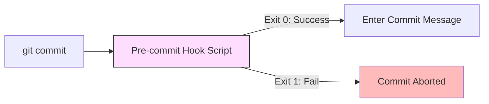

# CH-01: Pre-Commit Linting (The Personal Trainer)

> **"Jangan biarkan kesalahan konyol mencemari sejarah Anda. Verifikasi di lokal, dorong dengan percaya diri."**

## 🔗 1. Source Link
- [Customizing Git - Git Hooks (Official)](https://git-scm.com/book/en/v2/Customizing-Git-Git-Hooks)

## 📖 2. Penjelasan (The What & The Why)
**Git Hooks** adalah skrip kustom yang dijalankan Git secara otomatis saat kejadian tertentu terjadi di dalam siklus hidup repositori. **Pre-commit Hook** adalah yang paling populer; ia berjalan sesaat setelah Anda mengetik `git commit` tetapi sebelum pesan commit dibuat. Ini adalah tempat terbaik untuk menjalankan *Linter*, *Formatter*, atau *Unit Test* cepat guna memastikan kode yang masuk ke sejarah sudah bersih.

## 🏗️ 3. Architecture Concept: The Personal Trainer
Bayangkan sebuah **Gym**. Anda ingin mengangkat beban berat (Commit). **Pre-commit Hook** adalah pelatih pribadi Anda yang berdiri di samping Anda. Sebelum Anda mengangkat beban, ia memeriksa postur tubuh Anda (Linting). Jika postur Anda salah, ia akan menghentikan Anda sebelum Anda mencederai diri sendiri (merusak codebase).

## 📊 4. Visual Graph (Mermaid)
Siklus Eksekusi Hook Lokal:



## 🛠️ 5. Under-the-hood Mechanics
Semua hook disimpan dalam folder `.git/hooks/`. Secara default, Git membuat beberapa file contoh dengan ekstensi `.sample`. Untuk mengaktifkan sebuah hook, Anda cukup menghapus ekstensi `.sample`-nya dan memastikan file tersebut dapat dieksekusi (*executable*). Git akan mencari file dengan nama yang tepat (misal: `pre-commit`) dan menjalankannya menggunakan shell sistem.

## 🧪 6. Practical CLI Lab
Melihat daftar hook yang tersedia di repositori Anda:

```bash
# Masuk ke folder internal hooks
ls .git/hooks

# Melihat isi salah satu contoh hook (misal: pre-commit)
cat .git/hooks/pre-commit.sample
```

## 🤝 7. Team Impact (Social Governance)
Karena folder `.git` tidak ikut di-push ke server, hooks lokal biasanya dikelola menggunakan alat seperti **Husky** (untuk JS) atau **Pre-commit** (Python/Multi-lang). Ini memastikan seluruh tim menggunakan "Pelatih Pribadi" yang sama, menjaga kualitas kode tetap seragam di seluruh workstation pengembang.

## 🚑 8. The Rescue (Undo Tactics): Bypassing the Hook
Dalam situasi darurat di mana Anda harus melakukan commit tetapi linter terus-menerus gagal karena alasan teknis yang tidak relevan:
```bash
# Melewati pemeriksaan hook (Gunakan hanya jika benar-benar darurat!)
git commit -m "fix: emergency patch" --no-verify
```
