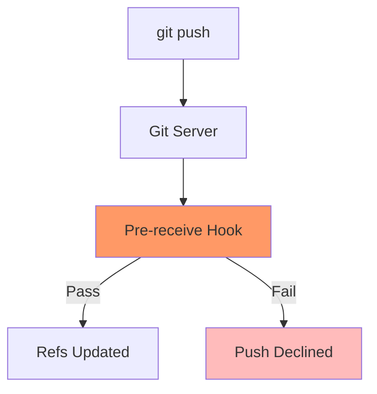

# CH-01: Pre-Receive Policies (The Customs Officer)

> **"Kedaulatan server adalah hukum tertinggi. Kode yang tidak patuh akan ditolak di perbatasan."**

## 🔗 1. Source Link
- [An Example Git-Enforced Policy (Official)](https://git-scm.com/book/en/v2/Customizing-Git-An-Example-Git-Enforced-Policy)

## 📖 2. Penjelasan (The What & The Why)
Berbeda dengan hook lokal yang bisa dilewati (`--no-verify`), **Server-side Hooks** (seperti `pre-receive`) berjalan di sisi server (GitHub Enterprise/GitLab/Server Git Sendiri) dan bersifat mutlak. Hook ini memeriksa setiap `push` yang masuk dan bisa menolak seluruh transaksi jika ada satu commit saja yang melanggar aturan (misal: file terlalu besar, tidak ada tanda tangan GPG, atau pesan commit tidak standar).

## 🏗️ 3. Architecture Concept: The Customs Officer
Bayangkan Anda sedang melintasi perbatasan negara. **Pre-receive Hook** adalah **Petugas Imigrasi & Bea Cukai**. Meskipun Anda sudah merasa rapi di rumah (Hook Lokal), petugas akan memeriksa paspor (Identitas GPG) dan barang bawaan Anda (Ukuran File) sekali lagi. Jika Anda membawa barang terlarang, Anda akan dipulangkan paksa dari perbatasan.

## 📊 4. Visual Graph (Mermaid)
Aliran Validasi Sisi Server:



## 🛠️ 5. Under-the-hood Mechanics
Saat menerima stream data, server memanggil skrip `pre-receive` dan memberikan daftar referensi yang akan diperbarui melalui `stdin`. Skrip ini kemudian memindai objek-objek baru yang masuk. Jika skrip keluar dengan status bukan nol (non-zero exit code), Git server akan segera membatalkan seluruh proses pengkinian referensi.

## 🧪 6. Practical CLI Lab
Mendeteksi penolakan dari server:

```bash
# Mencoba push ke cabang yang dilindungi tanpa izin
git push origin main

# Respon umum jika server hook menolak:
# ! [remote rejected] main -> main (pre-receive hook declined)
```

## 🤝 7. Team Impact (Social Governance)
Server-side hooks adalah benteng terakhir untuk **Organizational Compliance**. Ini menjamin bahwa tidak ada kode "ilegal" yang bisa masuk ke server utama, terlepas dari apa pun yang dilakukan pengembang di workstation lokal mereka.

## 🚑 8. The Rescue (Undo Tactics): Fix and Re-Push
Jika push Anda ditolak oleh server hook:
1. Baca pesan error dengan teliti; server biasanya memberikan alasan penolakan (misal: "Commit message format invalid").
2. Perbaiki commit Anda secara lokal (gunakan `git commit --amend` atau `git rebase -i`).
3. Lakukan push kembali setelah semua aturan terpenuhi.
