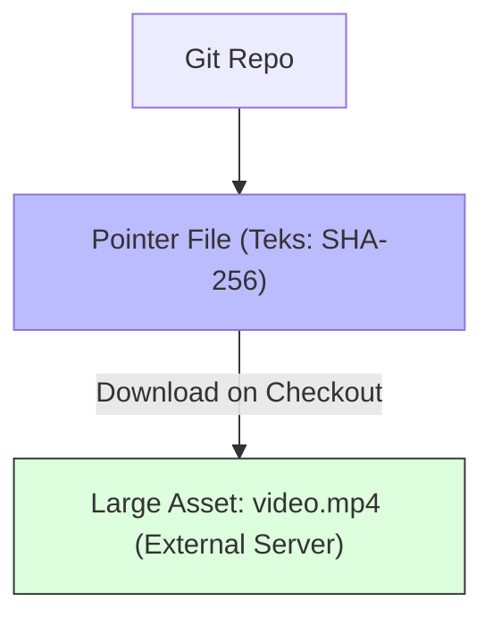

# CH-01: Binary Pointer Mechanics (Git LFS)

> **"Git didesain untuk kode, bukan untuk film. LFS adalah jembatan untuk aset raksasa."**

## 🔗 1. Source Link
- [Git Large File Storage (Official)](https://git-lfs.github.com/)

## 📖 2. Penjelasan (The What & The Why)
Git adalah database objek berbasis konten yang lambat saat menangani file binary besar (seperti video, PSD, atau dataset). Setiap kali Anda mengubah 1 pixel di video 1GB, Git tradisional akan mencoba menyimpan 1GB data baru. **Git LFS (Large File Storage)** mengganti file besar tersebut dengan **Pointer** kecil di dalam Git dan menyimpan file fisiknya di server eksternal, menjaga ukuran repository Anda tetap ramping.

## 🏗️ 3. Architecture Concept: The Storage Locker
Bayangkan Anda sedang di **Bandara**. Alih-alih membawa sofa (file besar) ke dalam pesawat (repositori), Anda menitipkannya di **Loker Penyimpanan** (LFS Server) dan hanya membawa **Kunci Loker** (Pointer) ke dalam pesawat. Saat sampai di tujuan (saat teman melakukan `pull`), mereka menggunakan kunci itu untuk mengambil sofa yang sama dari loker tersebut.

## 📊 4. Visual Graph (Mermaid)
Pemisahan Data di Git LFS:



## 🛠️ 5. Under-the-hood Mechanics
Internal LFS bekerja melalui mekanisme **Smudge & Clean Filters**. Saat Anda melakukan `git add`, filter "Clean" mengganti file asli dengan teks pointer. Saat Anda melakukan `git checkout`, filter "Smudge" mendeteksi pointer dan mengunduh file asli dari LFS server melalui HTTP API untuk diletakkan di working directory Anda.

## 🧪 6. Practical CLI Lab
Cara melacak file besar secara selektif:

```bash
# Inisialisasi LFS di repositori
git lfs install

# Menandai seluruh file MP4 untuk dikelola oleh LFS
git lfs track "*.mp4"

# Melihat riwayat pengelolaan LFS
git lfs ls-files
```

## 🤝 7. Team Impact (Social Governance)
LFS menghemat **Bandwidth & Disk Space** tim. Rekan tim yang tidak membutuhkan aset grafis (seperti pengembang backend) tidak perlu mengunduh gigabyte aset yang tidak relevan saat melakukan clone, mempercepat waktu integrasi mereka.

## 🚑 8. The Rescue (Undo Tactics): Missing Assets
Jika file besar Anda tidak muncul (hanya terlihat isi teks pointernya saja):
```bash
# Menarik paksa aset LFS yang tertinggal atau korup
git lfs pull
```
*Pastikan Anda memiliki koneksi internet dan izin akses ke server LFS.*
