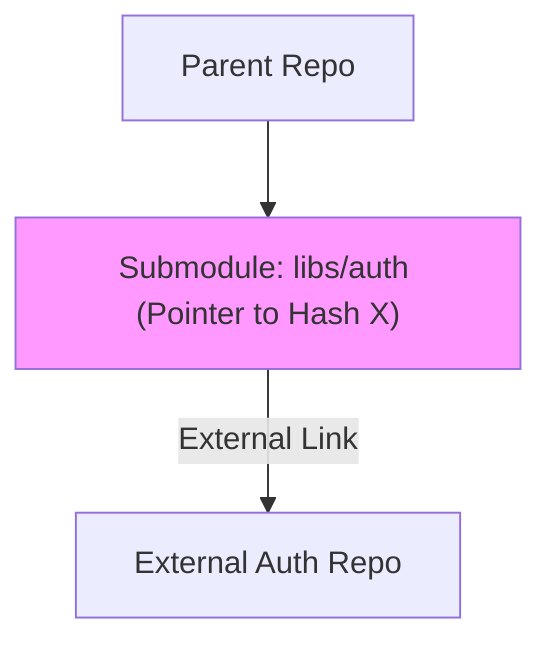

# CH-01: Dependency Orchestration (Submodules vs Subtrees)

> **"Kekuatan sebuah proyek sering kali terletak pada bagaimana ia menyatukan karya-karya hebat lainnya."**

## 🔗 1. Source Link
- [Git Tools - Submodules (Official)](https://git-scm.com/book/en/v2/Git-Tools-Submodules)
- [Git Tools - Subtree Merging](https://git-scm.com/book/en/v2/Git-Tools-Subtree-Merging)

## 📖 2. Penjelasan (The What & The Why)
Proyek besar sering kali bergantung pada kode dari repositori lain. Git menyediakan dua cara utama untuk mengelola ini:
1. **Submodules**: Menempelkan repositori luar sebagai "link" ke commit spesifik. Isinya tidak benar-benar masuk ke repositori Anda, hanya rujukan saja.
2. **Subtrees**: Menyalin seluruh isi repositori luar ke dalam folder di repositori Anda. Sejarahnya bercampur, tapi pengelolaannya lebih sederhana (mirip copy-paste berlevel tinggi).

## 🏗️ 3. Architecture Concept: The Library
Bayangkan Anda menulis **Buku**. **Submodule** adalah seperti memberikan **Catatan Kaki** (Footnote) yang merujuk ke buku lain di perpustakaan. Jika buku aslinya diperbarui, Anda harus mengecek perpustakaan lagi. **Subtree** adalah seperti memfotokopi bab dari buku lain dan menempelkannya langsung ke dalam buku Anda.

## 📊 4. Visual Graph (Mermaid)
Hirarki Submodule:



## 🛠️ 5. Under-the-hood Mechanics
Git Submodules menggunakan file `.gitmodules` di root untuk memetakan path lokal ke URL remote. Secara internal, Git memperlakukan folder submodule sebagai "gitlink"—sebuah tipe entri tree khusus yang hanya menyimpan SHA-1 commit dari repositori sebelah, bukan isi file-filenya.

## 🧪 6. Practical CLI Lab
Cara menambahkan dan menginisialisasi sub-proyek:

```bash
# Menambahkan repositori baru sebagai submodule
git submodule add https://github.com/example/lib-ui libs/ui

# Saat orang lain melakukan clone, mereka harus menginisialisasi submodule-nya
git submodule update --init --recursive
```

## 🤝 7. Team Impact (Social Governance)
Penggunaan submodule membutuhkan **Disiplin Tim**. Jika seseorang memperbarui submodule tapi tidak meng-commit rujukan hash-nya di parent repo, rekan tim lain akan mengalami error "Missing commit". Ini memerlukan protokol koordinasi yang ketat.

## 🚑 8. The Rescue (Undo Tactics): Detached Submodule
Jika submodule Anda "nyangkut" di versi lama atau tidak mau update:
```bash
# Menarik paksa versi terbaru dari server origin submodule
git submodule update --remote --merge
```
