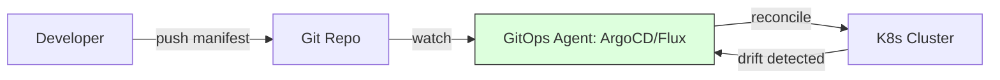

# CH-01: Pull vs Push Reconciliation (GitOps Core)

> **"Git bukan lagi sekadar tempat menyimpan kode; ia adalah pusat kendali operasi infrastruktur."**

## 🔗 1. Source Link
- [Guide to GitOps (Weaveworks)](https://www.weave.works/technologies/gitops/)

## 📖 2. Penjelasan (The What & The Why)
**GitOps** adalah model operasional untuk Cloud Native Applications (Kubernetes) yang menggunakan Git sebagai **Single Source of Truth** untuk seluruh infrastruktur dan aplikasi. Dalam GitOps, deskripsi infrastruktur bersifat *deklaratif*. Jika ada perbedaan antara apa yang tertulis di Git dan apa yang berjalan di server, sistem akan secara otomatis melakukan rekonsiliasi (penyelarasan).

## 🏗️ 3. Architecture Concept: The Mirror
Bayangkan sebuah **Cermin Ajaib**. Apa pun yang Anda gambar atau ubah pada pantulan di dalam cermin (Repositori Git), secara otomatis akan mewujud menjadi nyata di dunia fisik (Infrastruktur/Klaster). Jika seseorang mencoba mengubah dunia fisik secara manual tanpa melalui cermin, cermin tersebut akan "memperbaiki" dunia fisik kembali agar sesuai dengan pantulannya.

## 📊 4. Visual Graph (Mermaid)
Alur Kerja GitOps (Pull-based):



## 🛠️ 5. Under-the-hood Mechanics
Agent GitOps berjalan di dalam klaster dan terus-menerus melakukan *polling* ke Git. Ia membandingkan **Desired State** (apa yang ada di YAML/Git) dengan **Actual State** (apa yang sedang berjalan). Jika terjadi ketimpangan (*drift*), agent akan menjalankan perintah sinkronisasi untuk memastikan infrastruktur kembali ke kondisi yang diinginkan di Git.

## 🧪 6. Practical CLI Lab
Mensimulasikan perubahan deklaratif:

```bash
# Mengubah jumlah replika aplikasi di dalam manifest
sed -i 's/replicas: 1/replicas: 3/' deployment.yaml
git add deployment.yaml
git commit -m "ops: scale up web service to 3 replicas"
git push origin main

# Di sisi server (ArgoCD/Flux), perubahan ini akan otomatis dideteksi dan dieksekusi
```

## 🤝 7. Team Impact (Social Governance)
GitOps menyatukan **Dev dan Ops**. Tim operasi sekarang menggunakan alat yang sama dengan pengembang (Git). Ini meningkatkan keamanan karena tidak ada pengembang yang butuh akses langsung (`kubectl`) ke klaster produksi; mereka hanya perlu izin untuk melakukan *merge* ke cabang tertentu di Git.

## 8. 🚑 The Rescue (Undo Tactics): Infrastructure Rollback
Jika deployment baru menyebabkan sistem error, melakukan rollback infrastruktur adalah semudah melakukan revert di Git:
```bash
# Kembalikan manifest ke commit stabil sebelumnya
git revert HEAD
git push origin main
```
*Infrastruktur akan otomatis "mundur" ke versi stabil dalam hitungan detik.*
